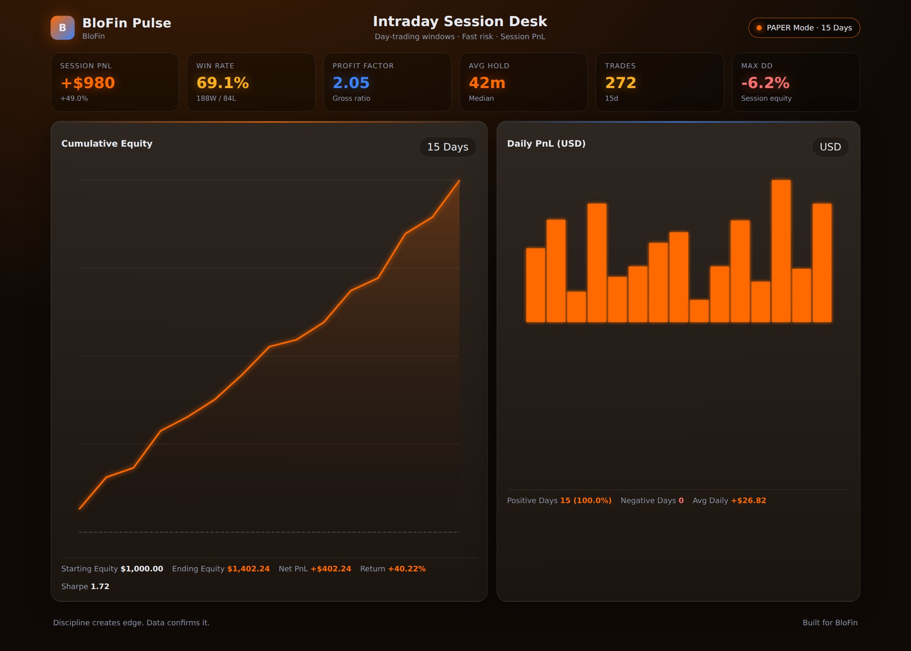
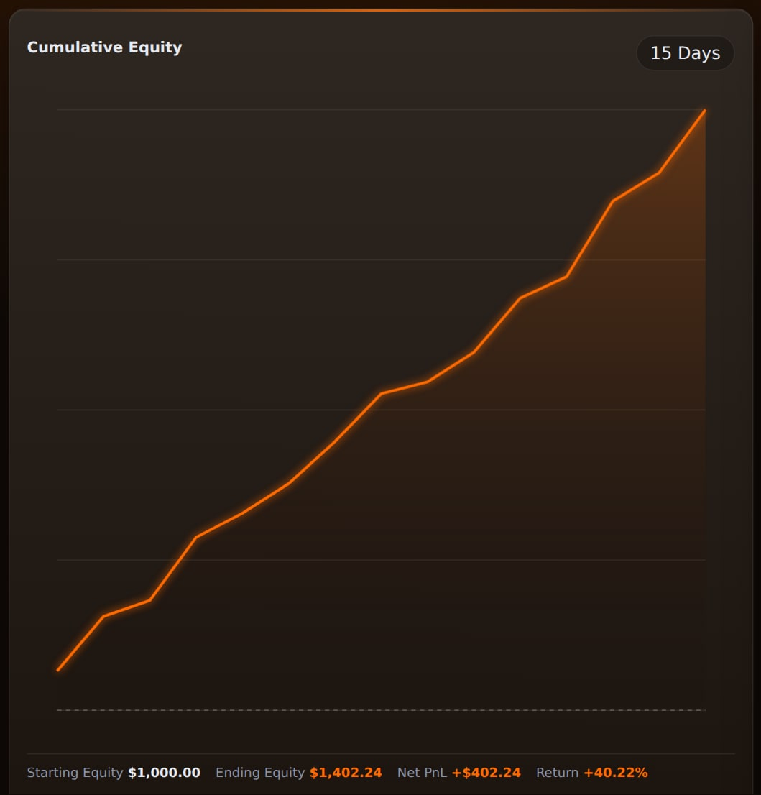
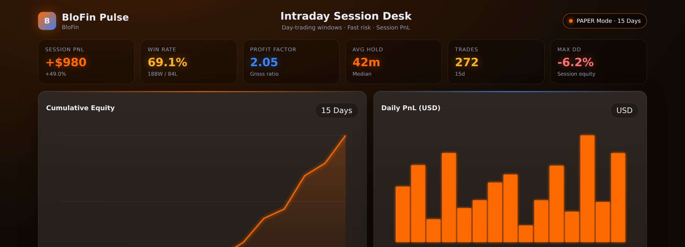
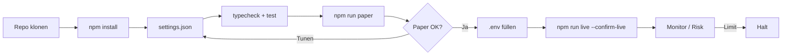
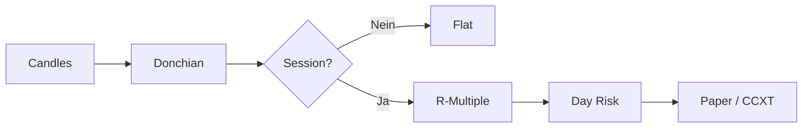

<p align="center">
  
</p>

# BloFin Day Trading Bot

<p align="center">
  <strong>Day-trading niche — multi-margin perps with R-multiple exits</strong><br/>
  blofin · paper + live · risk-gated · MIT
</p>

<p align="center">
  
  
  
  
</p>

<p align="center">
  Sprachen: [English](README.md) · [中文](README.zh.md) · **Deutsch** · [Español](README.es.md)
</p>

> **Suchbegriffe:** blofin trading bot · blofin day trading · blofin perps · multi margin futures bot

---

## Performance-Snapshot

Demo-Analytics aus dem statischen Dashboard (`npm run dashboard`). Banner und Strategie-Diagramme bleiben erhalten.

<p align="center">
  
</p>

<p align="center">
  
</p>

<p align="center">
  
</p>

---

## Projekt-Workflow

Klonen → konfigurieren → Paper → Credentials → Live. Risk immer an.



| | |
|--|--|
| `npm run paper` | Zuerst Paper — keine API-Keys |
| `npm run dashboard` | Lokales Analytics-Dashboard öffnen (statisch) |
| `npm run live` | Benötigt `--confirm-live` + API-Credentials |

---

## Platform-Fit

| | |
|--|--|
| Venue | blofin |
| Märkte | swap |
| Edge | Day-trading niche — multi-margin perps with R-multiple exits |
| Execution | CCXT Live (Sandbox) + Paper |

---

## Handelsstrategie

BloFin ist **Daytrading Multi-Margin Perps**. Donchian-Breakouts nur in UTC-Session, **R-Multiple-Sizing**, **Max Trades/Tag** gegen Revenge Trading.

### So funktioniert es
- **Session-Filter**.
- **Donchian-Breakout** mit Buffer.
- **R-Sizing**.
- **TP/SL in R**.
- **Day Budget**.
- **Liq-Distance Helper**.

### Wann der Edge erscheint
**Bestes Regime:** Session-Open-Liquidität auf BTC-Perps.

### Wann es scheitert
**Scheitert bei:** Chop-Whipsaws, zu hohem Hebel, sinnlos hohem maxTrades.

### Schlüsselparameter (`settings.json`)
- `lookback`/`bufferPct`
- R-Parameter
- Session/MaxTrades

### Strategiespezifische Risiken
- Daytrading Perps ohne Disziplin ist negativ nach Fees.
- Hebel niedrig halten.


---

## Strategie-Diagramm



---

## Architektur

```
src/
  config/     Zod settings + env loader
  strategy/   venue-specific engine
  broker/     paper + CCXT live adapters
  risk/       daily loss / drawdown / caps
  app/        runtime loop
  session/
  sizing/
  signals/
```

---

## Schnellstart

```bash
cd blofin-day-trading-bot
npm install
npm run typecheck
npm test
npm run paper
```

### Live

```bash
cp .env.example .env
# set BLOFIN_API_KEY + BLOFIN_API_SECRET
# optional BLOFIN_PASSWORD / PASSPHRASE
npm run live
```

---

## Konfiguration

`settings.json` — strategy + risk + paper/live flags.  
`.env` — secrets only (see `.env.example`).

---

## Risiko & Sicherheit

- Live refuses without `--confirm-live` and API credentials
- Prefer `live.sandbox: true` until proven
- Disable withdrawals on exchange API keys
- Daily loss / drawdown / notional caps + kill switch

---

## Haftungsausschluss

MIT-Bildungssoftware — **keine Finanzberatung**. CEX-Trading kann Totalverlust bedeuten.

## Lizenz

MIT — siehe [LICENSE](LICENSE).
