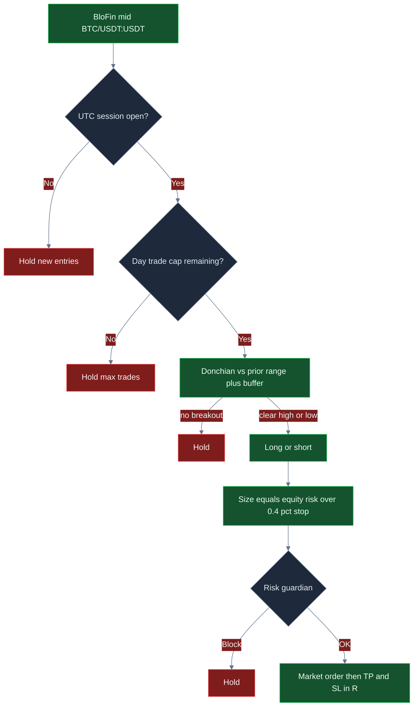

<p align="center">
  
</p>

# BloFin Day-Trading-Bot

<p align="center">
  <strong>Day-Trade BloFin-BTC-Perps wie ein Session-Desk: gepufferte Donchian-Breaks, R-Multiple-Exits, hartes Tages-Trade-Limit und Dollar-Bremsen vor jeder Market-Order.</strong><br/>
  blofin · BTC/USDT:USDT · Swap · Live-CCXT · session-gated · MIT
</p>

<p align="center">
  
  
  
  
  
</p>

<p align="center">
  Sprachen: [English](README.md) · [中文](README.zh.md) · **Deutsch** · [Español](README.es.md)
</p>

> **Suchbegriffe:** blofin trading bot · blofin day trading · blofin perps · blofin futures bot

BloFin ist fuer **intraday Multi-Margin-Perps** gebaut. Dieser Desk nimmt das ernst: Einstieg nur, wenn der Preis eine definierte Range verlaesst *und* die UTC-Session offen ist, Groesse als Anteil des Equities gegen eine 0,4%-Stop-Einheit, Take-Profit und Stop in R, und der naechste Clip wird verweigert, wenn Tagesbudget, Tagesverlust oder Drawdown schon heiss sind. Defaults sind ein Start-Desk — **das attraktive ROI- / Win-Rate- / Drawdown-Profil kommt, nachdem du Buffer, R-Multiples, Trade-Cap und Clip-Groesse auf dein Buch drehst.**

---

## Fuer wen

- Aktive Krypto-Trader, die in **Sessions, Breakouts, Fees und Risikoeinheiten** denken — nicht in Indikator-Tourismus.
- Desks, die **BloFin USDT-M Swap** (`BTC/USDT:USDT`) mit einem Tagesfenster wollen, nicht eine 24/7-Revenge-Schleife.
- Operatoren, die einen **Live-Execution-Pfad** brauchen (CCXT-Market-Orders, `--confirm-live`, API-Keys) mit **Kill-Switch und Dollar-Bremsen** vor jedem Intent.
- Tuner, die `settings.json` aendern, neu laufen und ein Buffer- + R-Set suchen, das *ihre* Fee-Stufe und Volatilitaet trifft — keine Leute, die eine garantierte Geldmaschine wollen.

Wenn du eine Blackbox „set and forget 100% Win Rate“ willst, ist das nicht. Wenn du einen **echten BloFin-Day-Desk willst, den du konfigurieren kannst**, lies weiter.

---

## Strategieueberblick

Eine Loop. Session zuerst. Breakout danach. R-Exits immer an.

**Session-Gate.** Neue Entries nur, solange die UTC-Stunde in `sessionUtcStartHour`–`sessionUtcEndHour` liegt (ausgeliefert **13–21**, US/EU-Overlap auf BTC-Perps). Ausserhalb haelt der Desk neue Clips. Offene Trades managen weiter TP und SL. Der Zaehler resetet am UTC-Datum, damit `maxTradesPerDay` ein echtes Tagesbudget ist, keine Prozesslebensdauer.

**Donchian-Breakout.** Die Engine haelt ein rollendes Mid-Fenster (Cap `lookback`, Default 18). Der letzte Print wird mit High/Low der *vorherigen* Bars verglichen. Long nur, wenn der Preis dieses High um `bufferPct` klaert (Default `0.12`, angewendet als **0,12%**). Short analog unter dem Low. Zu klein zahlst du Taker-Fees fuer Rauschen; zu gross verpasst du die Session-Expansion.

**Size.** Risiko-Dollar sind `equity × riskPerTradePct / 100`. Clip-Notional ist dieses Risiko geteilt durch die **0,4%**-Stop-Einheit, dann Cap bei `maxPositionUsd`. Auf einem $10k-Buch mit ausgeliefertem `0.4%`-Risiko will die Rohgroesse das ganze Buch — der **$2.500**-Clip-Cap ist, was wirklich fuellt. Wer mehr Punch will, hebt `riskPerTradePct` **zusammen mit** `maxPositionUsd`.

**Exits.** Stop-Distanz ist `0,4%` vom Mid × `stopLossR`. Take-Profit dieselbe Einheit × `takeProfitR`. Ausgeliefert **2R / 1R**. Die Exit-Order nutzt dasselbe Notional wie der Entry.

**Tagesbudget.** Nach `maxTradesPerDay` Fills (Default **6**) halt neue Entries bis zum naechsten UTC-Tag.

**Risk-Gate.** Tagesverlust, Peak-Drawdown, Max-Notional, Max-Position und Kill-Switch muessen **vor** der Platzierung alle klar sein.

```text
Mid → Session offen? → Tages-Cap uebrig? → Donchian + Buffer → Size vs 0,4% Stop → Risk Guardian → BloFin Market → TP/SL in R
```

---

## Warum dieser Edge stark sein kann

BloFin-Perps sind ein Day-Trading-Venue. Der Punkt ist **liquide Stunden, nicht Overnight-Inventar**. Ein 0,12–0,16%-Buffer auf BTC im 13–21-UTC-Overlap kann ein echter Range-Break sein. Derselbe Buffer in einer duennen Asien-Stunde ist oft nur eine Fee.

Die R-Struktur ist der zweite Punkt. Reine Breakout-Desks werden gehackt. Dieser Desk definiert den Payoff *vor* dem Fill: 1R raus, 2R–2,5R rein. Du brauchst keine 70% Win Rate. Du brauchst Winner, die nach 8 bps je Seite mehr behalten, als Loser zurueckgeben.

Der dritte Punkt ist **das Trade-Cap**. Sechs (oder vier) Session-Clips sind Policy. `maxTradesPerDay` auf 16 im selben Fenster kauft vor allem Fee-Drag. Das Cap haelt ein Day-Book als Day-Book.

Der vierte Punkt ist **Tunability**. Win Rate, Payoff und Drawdown sind nicht auf Defaults festgenagelt. Buffer weiten: meist weniger Trades, mehr vom Winner. `takeProfitR` heben: steilerer Payoff. Clip erst heben, wenn der Guardian noch sane wirkt. So wird aus „ruhiger Starter“ „das laeuft sich“.

Nichts hier ist eine Gewinn-Garantie. Dieselben Knöpfe, die Expectancy freischalten, zerlegen ein Buch, wenn du den Buffer in Chop ziehst und in eine One-Way-Squeeze groesser wirst.

---

## Marktregime

| Regime | So sieht das Tape aus | So verhaelt sich der Desk |
|---|---|---|
| **US/EU-Overlap, liquides BTC** | 13–21 UTC, echte Range-Expansionen auf BloFin-Perps | Breakouts koennen zahlen; Session-Gate arbeitet |
| **Sauberer Trendtag im Fenster** | High oder Low bricht mit Follow-through | 2R–2,5R-Targets werden getroffen; Trade-Cap stoppt Overtrading derselben Move |
| **Ruhige, enge Range** | Mikro-Wiggles im Lookback | Holds steigen; zu enger Buffer ist der Failure Mode |
| **Chop / Fakeout-Tape** | Breaks, die inner 0,4% sterben | Stops feuern; `bufferPct` weiten ist der Fix, nicht mehr Size |
| **One-Way-Squeeze nach Open** | Session-Trend ohne Pullback | Erste Clips koennen bluten; Tagesverlust- und Drawdown-Bremsen sind das Backstop |
| **Off-Hours / duenne Prints** | Ausserhalb 13–21 UTC | Neue Entries hold — by design |

**Laeuft, wenn:** liquide BTC-Perps, zweiseitiger Session-Flow, Buffer weit genug dass erwartete Move >> Taker + Slip, und ein Trade-Cap, das dich nicht Fees farmen laesst.

**Strugglet, wenn:** du den 0,12-Buffer in einer toten Range laesst, `maxTradesPerDay` hebst bis die Session nur Churn ist, oder der Clip am Cap klebt waehrend R noch 2/1 ist und Fees den Stop fressen.

---

## Mathematische Berechnungen

Das sind die Beziehungen, auf denen der Desk steht. Attraktive Expectancy ist eine **Parameterwahl**, kein Default-Geschenk.

### Range-Breakout

Mit Lookback \(n =\) `lookback` und Buffer \(b =\) `bufferPct` / 100 (also `0.12` → **0,12%**):

$$
H_t = \max(\text{prior closes}),\quad L_t = \min(\text{prior closes})
$$

$$
\text{long} \iff C_t > H_t(1+b) \;\text{and session open},\qquad \text{short} \iff C_t < L_t(1-b) \;\text{and session open}
$$

Ein weiteres \(b\) schneidet Fakeouts und **hebt meist Payoff / senkt Trade-Count**. Enger macht das Gegenteil.

### Stop-Einheit und R-Multiples

Die Engine nutzt **0,4% vom Mid** als Stop-Einheit (`STOP_UNIT_PCT`). Mit `stopLossR` / `takeProfitR`:

$$
\text{stop distance} = 0.004 \times \texttt{stopLossR} \times C_t
$$

$$
\text{take-profit distance} = 0.004 \times \texttt{takeProfitR} \times C_t
$$

Ausgeliefert 2R / 1R ist ein **+0,80% / −0,40%**-Design. Getuned 2,5R / 1R ist **+1,00% / −0,40%**.

### Positionsgroesse (wie kodiert)

$$
N = \min\!\left(\frac{E \times \texttt{riskPerTradePct}/100}{0.004},\ \texttt{maxPositionUsd}\right)
$$

Auf $10k mit `riskPerTradePct = 0.4` ist raw \(N\) $10.000. Der ausgelieferte **$2.500**-`maxPositionUsd` ist der bindende Clip. **Das ist R-Sizing, dann ein harter Dollar-Cap** — kein ATR.

### Breakeven-Win-Rate

$$
\text{payoff} \approx \frac{\texttt{takeProfitR}}{\texttt{stopLossR}},\qquad
\text{breakeven win rate (before fees)} = \frac{SL}{TP + SL}
$$

Fuer 2R vs 1R ist der Floor **33%**. Fuer 2,5R vs 1R **29%**. Fees heben den Floor — deshalb zaehlen Buffer und Tages-Cap. Round-Trip 8 bps je Seite ist **0,16%**, etwa **0,4R** gegen einen 0,4%-Stop. Nach Kosten verhaelt sich 2,5R / 1R in Dollars naeher an **~1,5 Payoff**. Du brauchst trotzdem **keine** 70% Wins. Du musst aufhoeren, diese 0,4R in Fakeouts zu zahlen.

### Erwartungswert (konzeptuell)

$$
EV = p \cdot W - (1-p) \cdot L
$$

wobei \(p\) Win Rate, \(W\) Avg Win, \(L\) Avg Loss. Nach Kosten:

$$
EV_{\text{net}} = EV - N \cdot (f + s)
$$

mit \(f\) Fee-Anteil und \(s\) Slippage-Anteil. Ausgeliefertes Paper `feeBps` ist **8**, `slippageBps` **5**.

### Warum getunte Math attraktiv aussehen kann

Bei 2,5R / 1R auf einem $4.000-Clip druckt eine ~55% Win Rate nach 8 bps je Seite grob **+$8,40 EV pro Fill**. Beim ausgelieferten 2R / 1R auf $2.500 mit lautem 0,12-Buffer faellt EV Richtung **Scratch**, weil Fees auf einem kurzen Stop sitzen. **Dieselbe Engine. Andere Knoepfe.**

---

## Statistische Analyse

Ergebnisse haengen von Settings, Regime und Tuning ab. Es gibt **keinen garantierten Gewinn**. Die Zahlen unten sind **Szenario-Bloecke** aus der Strategie-Math (0,4%-Stop-Einheit, R-Exits, 8 bps Fees, session-selektiv vs. laute Buffer) auf einem **$10.000 BTC/USDT:USDT**-Buch. Kein Versprechen eines konkreten historischen Backtests.

### 1) Optimiertes Szenario (illustrativ) — zuerst

**Annahmen:** Lookback `22`, Buffer `0.16`, Risiko `0.5%` mit `maxPositionUsd` **4000**, also Clip **$4.000**, `takeProfitR` `2.5` / `stopLossR` `1`, `maxTradesPerDay` `4`, Session **13–21 UTC**, liquide BloFin-BTC-Stunden.

| Metrik | Getuntes Szenario | Bedeutung | Warum ein Trader das braucht |
|---|---:|---|---|
| Sample | **120 Trades** | ~4 selektive Clips × 30 Session-Tage | Ein Day-Desk, kein 24/7-Churn-Bot |
| Win Rate | **55,0%** | Etwas mehr als die Haelfte der Clips laeuft | Bei ~2,5R-Design brauchst du **keine** 70% Wins |
| Loss Rate | **45,0%** | Verluste sind geplante 1R, keine Ueberraschungen | Guardian + Stop-Einheit existieren fuer diese Seite |
| Avg Win / Avg Loss | **$33,60 / $22,40** | Nach 8 bps je Seite auf $4k-Clip | Payoff ist R minus Fee-Drag — Buffer haelt ihn |
| Payoff-Ratio | **1,50** | Avg Win ÷ Avg Loss nach Kosten | Fees machen aus 2,5R ~1,5 in Dollars; trotzdem handelbar |
| Expectancy / Trade | **+$8,40** | Durchschnittliches Dollar-Ergebnis pro Fill | Positives EV ist der einzige Grund, Size zu skalieren |
| Net-PnL / ROI | **+$1.008 / +10,1%** | Buch nach dem Sample | Was du im Equity spuerst — trotzdem Szenario, trotzdem regimeabhaengig |
| Profit Factor | **1,83** | Brutto-Wins ÷ Brutto-Losses | Klar ueber dem default-aehnlichen Scratch-Buch |
| Max Drawdown | **4,9%** | Schlechtester Peak-to-Trough im Sample | Unter dem 8%-Halt — Spielraum, keine Lizenz fuer 10× Size |
| Return / Risk | **~2,1** | +10,1% vs 4,9% DD | Glatt genug zum Sitzenbleiben; kein Lotterielos |
| Best / Worst Trade | **+$34 / −$23** | Tail der R-Verteilung | Worst sollte ~1R plus Fees aussehen, kein Blow-up |
| Max Win- / Loss-Streak | **7 / 4** | Clustering | Vier Losses in Folge sind der Grund fuer `maxDailyLossUsd` |
| Mix | **100% Session-Breakouts** | Keine Off-Hours-Entries | Das Session-Gate *ist* der Filter |

**Klartext:** breiterer Buffer, 2,5R-Target, vier Clips am Tag, Clip gross genug, dass 1%-Winner das Buch bewegen. Das ist das Profil, das sich zu suchen lohnt. Deine Live-Zahlen bewegen sich mit BTC-Vol, BloFin-Fees und wie hart du `maxPositionUsd` drückst.

```text
TUNED SCENARIO (illustrative)     $10k book · 120 fills
Win rate  55.0%   Payoff  1.50   EV/trade  +$8.40
ROI      +10.1%   PF      1.83   Max DD     4.9%
```

### 2) Untuned / default-aehnlicher Kontrast (illustrativ)

Shipped-like: Lookback `18`, Buffer `0.12`, Risiko `0.4%` (**$2.500-Clips** auf $10k), 2R/1R, `maxTradesPerDay` `6`, dieselben 8 bps.

| Metrik | Default-aehnlich | vs getuned |
|---|---:|---|
| Sample | 60 Fills, lauter | Mehr Aktivitaet pro Session, weniger Qualitaet |
| Win Rate | 49,0% | Muenzwurf nach Fakeouts |
| Payoff | 1,14 | 2R-Design, Fees flatten Richtung 1:1 |
| Expectancy | ~+$0,70 | Scratch nach Kosten |
| ROI | ~+0,4% | Starter, nicht die Decke |
| Profit Factor | 1,10 | Eine schlechte Session wischt das Sample |
| Max Drawdown | 7,2% | Nah am 8%-Halt |

**Takeaway:** Defaults sind eine **sichere Rampe**, kein Performance-Ziel. Der Sprung von ~1,1 Profit Factor auf ~1,8 im getunten Block ist vor allem **Buffer + 2,5R + weniger Clips + ein Clip, den der Guardian wirklich erlaubt** — kein anderer Bot.

### Regime-Skizze (getuntes Szenario)

| Sleeve | Anteil der Fills | Kommentar |
|---|---:|---|
| Session-Range-Break | ~100% | Donchian + Buffer ist der einzige Entry |
| Off-Hours | 0% | Session-Gate haelt |
| Cap-halted Stunden | skipped | `maxTradesPerDay = 4` arbeitet |

---

## Charts

**Gruen = Win / Profit. Rot = Loss / schwaecherer Pfad.** Decision-Flow ist GitHub-Mermaid. Performance-Charts sind 2D-gerenderte PNGs mit leichtem 3D-Look, damit sie auf GitHub ankommen.

### Entscheidungslogik



### Win- / Loss-Mix

<p align="center">
  
</p>

Die Pies sehen aehnlich aus. **Payoff und Clip-Groesse aendern sich.** Getuned haelt ~2,5R-Winner nach Fees (gruen); default-aehnlich laesst enger Buffer und 2R-Design das R flatten (groesserer roter Anteil am *Dollar*-Buch).

### Expectancy vs Breakout-Buffer

<p align="center">
  
</p>

Zu eng (`0.08`, rot) overtradet BloFin-Rauschen. Ausgeliefert `0.12` ist nutzbar. **`0.16` ist der illustrative gruene Peak**, bevor der Buffer so weit wird, dass Session-Fills verhungern.

### Equity-Pfad

<p align="center">
  
</p>

Gruene Linie: getuntes Szenario. Rote Linie: default-aehnlicher Drift. Dasselbe Venue, derselbe Donchian — **andere Knoepfe**.

### Drawdown

<p align="center">
  
</p>

Rote Flaeche ist der Underwater-Pfad. Die gestrichelte gruene Linie ist der 8%-Guardian-Floor. Der getunte Pfad blieb in diesem Szenario bei ~4,9%. Wenn du Size verdreifachst ohne Buffer zu weiten, tagged diese Huelle den Halt.

---

## Parameter-Tuning — so schaltest du besseres ROI, Win Rate und Loss-Control frei

Behandle `settings.json` als **Desk**, nicht als Trophy-Screen.

| Wenn du willst… | Dreh das | In diese Richtung | Failure Mode |
|---|---|---|---|
| Weniger Fakeouts, besserer Payoff | `bufferPct` | **0.12 → 0.16–0.20** | Zu weit → fast keine Fills in der Session |
| Steilerer Payoff | `takeProfitR` / `stopLossR` | z. B. **2.5 / 1.0** | Riesiges TP mit engem Buffer → WR stirbt |
| Weniger Fee-Churn | `maxTradesPerDay` | **6 → 4** | So eng, dass du den einzigen sauberen Break verpasst |
| Mehr Punch pro Fill | `riskPerTradePct` **und** `maxPositionUsd` | **Zusammen** heben | Nur Risiko% → immer noch $2.500-Cap |
| Engere Session | `sessionUtcStartHour` / `EndHour` | Bei **13–21** bleiben oder engen | In asiatische duenne Prints weiten → Fakeouts |
| Engerer Pain-Cap | `maxDailyLossUsd`, `maxDrawdownPct` | Beim Lernen etwas **enger** | So eng, dass ein normaler Tag nie recovered |

**Praktische Reihenfolge**

1. Size am ausgelieferten Cap lassen. **Buffer** aendern, bis du nicht jedes Wiggle tradest.
2. **takeProfitR** Richtung 2,5, bis Winner den 0,4%-Stop wert sind.
3. **maxTradesPerDay** kuerzen, bis die Session selektiv ist, nicht busy.
4. BloFin-Taker-Fees gegen die 8-bps-Ehrlichkeit im Paper-Cost-Modell pruefen.
5. Erst dann `maxPositionUsd` (und Risiko%) auf den Clip heben, den du wirklich willst.
6. Stoppen, wenn Profit Factor und Drawdown wie ein Buch aussehen, mit dem du leben kannst — nicht wenn eine Session heroisch wirkt.

---

## Risikomanagement

Das sind die ausgelieferten Bremsen in `settings.json`. Sie sitzen vor **jedem** Order-Intent.

| Bremse | Default | Verhalten |
|---|---:|---|
| `sessionUtcStartHour` / `EndHour` | **13 / 21** | Keine neuen Entries ausserhalb des UTC-Fensters |
| `maxTradesPerDay` | **6** | Day-Desk-Budget; Reset am UTC-Datum |
| `maxDailyLossUsd` | **250** | Halt wenn Tages-PnL ≤ −$250 |
| `maxDrawdownPct` | **8** | Halt bei 8% vom Peak-Equity |
| `maxNotionalUsd` | **5000** | Blockt Clips ueber Gross-Notional-Cap |
| `maxPositionUsd` | **2500** | Bindender Clip-Cap bei ausgeliefertem Risiko% |
| `killSwitch` | **false** | `true` friert alle Intents ohne Redeploy |
| `riskPerTradePct` | **0.4** | R-Sizer-Input; trifft den $2.500-Cap auf $10k |
| Live-Arming | `confirmRequired` + `--confirm-live` | Live startet nicht mit einem beilaeufigen `npm start` |
| Sandbox-Flag | `live.sandbox: true` | An lassen, bis der Live-Pfad auf deinen Keys sitzt |

Perps implizieren **Liquidationsrisiko**, wenn du Exchange-Leverage dazunimmst. Clip-Caps ersetzen keine BloFin-Margin-Hygiene. Withdrawals auf API-Keys deaktivieren. Nie `.env` committen.

---

## End-to-end so laeuft es

1. **Boot** — `settings.json` laden (Zod-validiert) und optionales `.env`.
2. **Mode** — `npm run paper` nutzt den Paper-Broker (keine Keys). `npm run live -- --confirm-live` baut einen CCXT-BloFin-Client und platziert **Market**-Orders auf Swap.
3. **Loop** — Mid holen → Close-Fenster updaten → Session-Check → Day-Cap-Check → Donchian + Buffer.
4. **Size** — Risiko% / 0,4%-Stop-Einheit, dann `maxPositionUsd`.
5. **Guardian** — Kill-Switch, Tagesverlust, Drawdown, Notional, Position. Fail-closed: kein „nur diesmal“.
6. **Execute** — Paper-Fill oder CCXT `createOrder` Market auf `BTC/USDT:USDT`. Offene Trades exitten bei TP oder SL auf **demselben Notional**.
7. **Ledger** — Jede Loop schreibt Action, Reason, PnL, Equity. End-Summary: Trade-Count, PnL, Win Rate, max Consecutive Losses.
8. **Dashboard** — `npm run dashboard` serviert die lokale Analytics-UI auf Port 4173.

Paper und Live teilen `src/strategy` und `src/risk`. Nur `src/broker` wechselt. Das ist der Production-Workflow: **dieselbe Entscheidung, anderer Venue-Adapter**.

---

## Quick Start

```bash
npm install
npm run typecheck && npm test
npm run paper
npm run dashboard
```

Dashboard: `http://localhost:4173` oeffnen.

Ausgelieferte Session ist **13–21 UTC**. Ausserhalb halten neue Entries (der Day-Desk arbeitet). Um die Loop zu jeder Stunde zu ueben, setze voruebergehend `sessionUtcStartHour` auf `0` und `sessionUtcEndHour` auf `24`.

### Live (BloFin)

```bash
cp .env.example .env
# set BLOFIN_API_KEY and BLOFIN_API_SECRET
# optional BLOFIN_PASSWORD / BLOFIN_PASSPHRASE
# disable withdrawals on the key; prefer IP whitelist
npm run live -- --confirm-live
```

Node **20+**. Strategie und Risiko leben in `settings.json`. Secrets nur in `.env`.

---

## Wichtige Konfigurationsknoepfe

Jede Zeile mappt auf `settings.json`. Strategie-Knoepfe formen den Edge; Risiko-Knoepfe sind harte Bremsen.

| Parameter | Ort | Default | Bedeutung | Warum es zaehlt | Typischer Arbeitsbereich |
|---|---|---|---|---|---|
| `lookback` | strategy | `18` | Bars im Donchian-Fenster | Range-Gedaeechtnis | 12 – 24 |
| `bufferPct` | strategy | `0.12` | Extra-% jenseits High/Low (**0,12%**) | Fakeout-Filter — **#1 Qualitaetsknopf** | 0.10 – 0.20 |
| `riskPerTradePct` | strategy | `0.4` | Equity-% zum 0,4%-Stop | Size-Dial (oft gecappt) | 0.25 – 0.6 |
| `takeProfitR` | strategy | `2` | TP in R | Payoff-Skew | 1.5 – 2.5 |
| `stopLossR` | strategy | `1` | SL in R | Risikoeinheit | 0.75 – 1.25 |
| `maxTradesPerDay` | strategy | `6` | Taegliches Entry-Cap (UTC-Datum) | Anti-Churn / Anti-Revenge | 3 – 8 |
| `sessionUtcStartHour` | strategy | `13` | Session-Open (UTC) | Liquid-Hours-Gate | 12 – 14 |
| `sessionUtcEndHour` | strategy | `21` | Session-Close (UTC) | Keine neuen Entries danach | 20 – 22 |
| `maxDailyLossUsd` | risk | `250` | Tages-PnL-Halt ($) | Stoppt Revenge-Trading | 150 – 350 auf $10k |
| `maxDrawdownPct` | risk | `8` | Peak-to-Trough-Halt (%) | Deckt Regime-Schock | 5 – 12 |
| `maxNotionalUsd` | risk | `5000` | Brutto-Notional-Cap | Blast-Radius | ≤ 50% Equity |
| `maxPositionUsd` | risk | `2500` | Single-Clip-Cap | **Bindender Size-Cap** auf $10k | 2000 – 4000 |
| `killSwitch` | risk | `false` | Sofort-Freeze | Ops-Halt | bei Incident auf `true` |
| `symbol` | root | `BTC/USDT:USDT` | Gehandeltes Pair | Bei Majors bleiben bis bewiesen | BTC/ETH USDT Swap |
| `marketType` | root | `swap` | CCXT defaultType | BloFin USDT-M | swap |
| `feeBps` / `slippageBps` | paper | `8` / `5` | Kostenmodell | Ehrlichkeit des EV | an deine VIP-Stufe anpassen |

### Getuntes Parameter-Beispiel (Startpunkt zum Suchen, kein Zertifikat)

```json
{
  "risk": {
    "maxDailyLossUsd": 250,
    "maxDrawdownPct": 8,
    "maxNotionalUsd": 5000,
    "maxPositionUsd": 4000,
    "killSwitch": false
  },
  "strategy": {
    "type": "day",
    "lookback": 22,
    "bufferPct": 0.16,
    "riskPerTradePct": 0.5,
    "takeProfitR": 2.5,
    "stopLossR": 1,
    "maxTradesPerDay": 4,
    "sessionUtcStartHour": 13,
    "sessionUtcEndHour": 21
  }
}
```

Ausgelieferte Defaults bleiben in `settings.json` als konservative Rampe. Kopiere den Block oben, wenn du das **getunte** Profil aus der Statistischen Analyse suchen willst.

---

## Beispiel-Trade-Walkthrough

**Setup.** BloFin `BTC/USDT:USDT`, $10.000 Equity, getunter Buffer `0.16`, Lookback `22`, Risiko `0.5%`, `maxPositionUsd` `4000`. Guardian: −$250 Tag / 8% DD. Session 13–21 UTC. Vier-Trade-Tages-Cap.

**Tape.** 15:40 UTC. Die letzten 22 Mids bauten eine Range mit High \(H\). Der naechste Mid printed **0,18% ueber \(H\)**. Session offen. Tageszaehler 1/4. Donchian-Long feuert.

**Size.** Risiko = $50. Stop-Einheit = 0,4%. Raw \(N = 50 / 0.004 = \$12{,}500\), dann Cap **$4.000**. Guardian sieht Notional unter $5.000, Tages-PnL nicht gehaltet, Kill-Switch aus → **OK**.

**Fill.** Market-Buy auf BloFin-Swap. Reason-Tag: `breakout_long`. Stop 0,4% darunter; Take-Profit 1,0% darueber (2,5R). Fee markiert bei 8 bps (~$3,20 auf diesem Clip).

**Exit.** Preis erreicht das 2,5R-Target. Der Desk verkauft **$4.000** Notional (derselbe Clip, kein Stub). Ledger bucht ~+$33,60 nach Exit-Fee.

**Alternate Loop (Session-Hold).** Gleicher Break, aber die Uhr ist **06:10 UTC**. Session-Gate failt. Action: `hold` / `session_closed`. Dieser Skip *ist* der Day-Desk.

**Alternate Loop (Cap).** Vierter Fill schon genommen. Fuenfter Breakout am selben UTC-Tag → `hold` / `max_trades`.

**Schlechter Tag.** Drei 1R-Loser an einem choppy Open. Tages-PnL trifft −$250 → Guardian **halt**. Du „holst das nicht nach“ nach 21:00. Das ist das Produkt bei der Arbeit.

---

## Download. Tune. Finde deinen besten Desk.

Repo klonen. Tests laufen. Auf BloFin BTC/USDT-Swap mit den ausgelieferten Bremsen starten. Dann **Buffer**, **takeProfitR**, **maxTradesPerDay** und **maxPositionUsd** bewegen, bis das Buch wie das getunte Szenario aussieht, mit dem du wirklich leben willst — hoeherer Payoff, weniger Junk-Breaks, Drawdown noch im Guardian.

Der Edge ist kein Geheimindikator. Es ist **BloFin-Session-Liquiditaet + ein Buffer, den du waehlst + R, mit dem du leben kannst + Bremsen, die feuern**. Die Decke liegt in `settings.json`. Geh sie suchen.

```bash
npm install && npm test && npm run paper
```

**Lizenz:** MIT — siehe [LICENSE](LICENSE).
