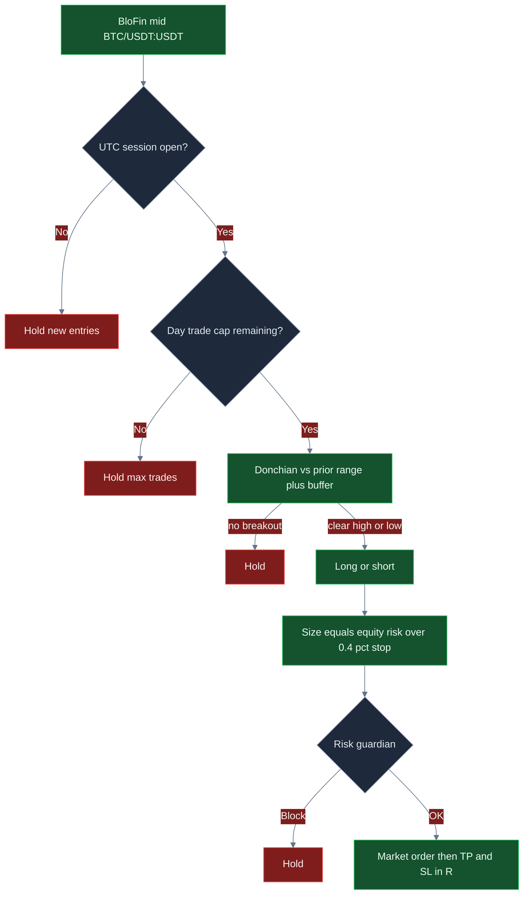

<p align="center">
  
</p>

# Bot de day trading BloFin

<p align="center">
  <strong>Opera perps BTC de BloFin como un desk de sesion: rupturas Donchian con buffer, salidas en R, tope diario duro de trades y frenos en dolares delante de cada orden de mercado.</strong><br/>
  blofin · BTC/USDT:USDT · swap · CCXT en vivo · session-gated · MIT
</p>

<p align="center">
  
  
  
  
  
</p>

<p align="center">
  Idiomas: [English](README.md) · [中文](README.zh.md) · [Deutsch](README.de.md) · **Español**
</p>

> **Palabras de busqueda:** blofin trading bot · blofin day trading · blofin perps · blofin futures bot

BloFin esta hecho para **perps intradía de margen multiple**. Este desk lo toma en serio: entra solo cuando el precio deja un rango definido *y* la sesion UTC esta abierta, dimensiona una fraccion del equity contra una unidad de stop del 0,4%, toma profit y stop en R, y rechaza el siguiente clip cuando el presupuesto del dia, la perdida diaria o el drawdown ya estan calientes. Los defaults son un desk de arranque — **el perfil atractivo de ROI / win rate / drawdown aparece cuando afinas buffer, R, tope de trades y tamano de clip a tu libro.**

---

## Para quien es

- Traders de cripto que ya piensan en **sesiones, rupturas, fees y unidades de riesgo** — no turismo de indicadores.
- Desks que quieren **swap USDT-M de BloFin** (`BTC/USDT:USDT`) con ventana de dia, no un bucle de venganza 24/7.
- Operadores que necesitan una **ruta de ejecucion en vivo** (ordenes de mercado CCXT, `--confirm-live`, API keys) con **kill switch y frenos en dolares** delante de cada intencion.
- Quienes van a cambiar `settings.json`, relanzar y buscar un set de buffer + R que encaje con *su* tarifa y volatilidad — no gente que busca una maquina de dinero garantizado.

Si quieres una caja negra “set and forget 100% win rate”, esto no es. Si quieres un **desk de dia BloFin de mercado real que puedes configurar**, sigue leyendo.

---

## Resumen de la estrategia

Un loop. Primero la sesion. Despues el breakout. Salidas en R siempre on.

**Puerta de sesion.** Nuevas entradas solo mientras la hora UTC esta dentro de `sessionUtcStartHour`–`sessionUtcEndHour` (de fabrica **13–21**, overlap US/EU en perps BTC). Fuera de la ventana el desk aguanta clips nuevos. Los trades abiertos siguen gestionando take-profit y stop. El contador se resetea en la fecha UTC para que `maxTradesPerDay` sea un presupuesto de dia real, no la vida del proceso.

**Ruptura Donchian.** El motor guarda una ventana rodante de mids (tope `lookback`, default 18). Compara el ultimo print con el high/low de las barras *previas*. Long solo si el precio supera ese high por `bufferPct` (default `0.12`, aplicado como **0,12%**). Short si rompe el low por el mismo buffer. Demasiado pequeno y pagas taker por ruido; demasiado grande y te pierdes la expansion de sesion.

**Tamano.** Los dolares de riesgo son `equity × riskPerTradePct / 100`. El nocional del clip es ese riesgo dividido por la unidad de stop del **0,4%**, luego tope en `maxPositionUsd`. En un libro de $10k con riesgo de fabrica `0.4%`, el tamano crudo quiere el libro entero — el tope de clip de **$2.500** es lo que realmente llena. Quien quiere mas punch sube `riskPerTradePct` **junto con** `maxPositionUsd`.

**Salidas.** Distancia de stop = `0,4%` del mid × `stopLossR`. Take-profit = la misma unidad × `takeProfitR`. De fabrica **2R / 1R**. La orden de salida usa el **mismo nocional** que la entrada.

**Presupuesto del dia.** Tras `maxTradesPerDay` fills (default **6**), las entradas nuevas paran hasta el siguiente dia UTC.

**Puerta de riesgo.** Perdida diaria, drawdown de pico, nocional max, posicion max y kill switch deben pasar **antes** de colocar.

```text
mid → sesion abierta? → cupo del dia? → Donchian + buffer → size vs stop 0,4% → guardian de riesgo → mercado BloFin → TP/SL en R
```

---

## Por que este edge puede ser potente

Los perps de BloFin son un venue de day trading. El punto es **horas liquidas, no inventario overnight**. Un buffer de 0,12–0,16% en BTC durante el overlap 13–21 UTC puede ser una ruptura de rango real. El mismo buffer en una hora asiatica fina suele ser solo fee.

La estructura en R es el segundo punto. Los desks de breakout puro se pican. Este desk define el payoff *antes* del fill: 1R fuera, 2R–2,5R dentro. No necesitas 70% de win rate. Necesitas winners que, tras 8 bps por lado, conserven mas de lo que devuelven los losers.

El tercer punto es **el tope de trades**. Seis (o cuatro) clips de sesion es politica. Subir `maxTradesPerDay` a 16 en la misma ventana compra sobre todo drag de fees. El tope es como un libro de dia sigue siendo un libro de dia.

El cuarto punto es **tunabilidad**. Win rate, payoff y drawdown no estan clavados a los defaults. Ensancha el buffer y sueles operar menos y quedarte mas de cada winner. Sube `takeProfitR` y el sesgo de payoff se pone mas empinado. Sube el clip solo cuando el guardian sigue sane. Asi el desk pasa de “starter silencioso” a “esto vale la pena”.

Nada aqui es garantia de beneficio. Los mismos knobs que desbloquean expectancy destrozan un libro si aprietas el buffer en chop y subes size en un squeeze de un solo lado.

---

## Regimenes de mercado

| Regimen | Como se ve el tape | Que tiende a hacer el desk |
|---|---|---|
| **Overlap US/EU, BTC liquido** | 13–21 UTC, expansiones de rango reales en perps BloFin | Los breakouts pueden pagar; la puerta de sesion trabaja |
| **Dia de tendencia limpia en la ventana** | High o low sigue rompiendo con follow-through | Targets 2R–2,5R se tocan; el tope evita sobreoperar el mismo move |
| **Rango quieto y estrecho** | Micro oscilaciones dentro del lookback | Suben los holds; un buffer demasiado justo es el failure mode |
| **Chop / tape de fakeout** | Rupturas que mueren dentro del 0,4% | Disparan stops; el arreglo es ensanchar `bufferPct`, no mas size |
| **Squeeze de un lado tras el open** | Tendencia de sesion sin pullback | Los primeros clips pueden sangrar; frenos de perdida diaria y drawdown son el backstop |
| **Fuera de horas / prints finos** | Fuera de 13–21 UTC | Nuevas entradas en hold — por diseno |

**Funciona cuando:** perps BTC liquidos, flujo de sesion a dos lados, buffer suficientemente ancho para que el move esperado >> taker + slip, y un tope de trades que no te deje farmear fees.

**Sufre cuando:** corres el buffer 0,12 de fabrica en un rango muerto, subes `maxTradesPerDay` hasta que la sesion es todo churn, o el clip esta en el tope con R aun 2/1 y las fees se comen el stop.

---

## Calculos matematicos

Estas son las relaciones sobre las que esta construido el desk. La expectancy atractiva es una **eleccion de parametros**, no un regalo del default.

### Ruptura de rango

Con lookback \(n =\) `lookback` y buffer \(b =\) `bufferPct` / 100 (asi `0.12` → **0,12%**):

$$
H_t = \max(\text{prior closes}),\quad L_t = \min(\text{prior closes})
$$

$$
\text{long} \iff C_t > H_t(1+b) \;\text{and session open},\qquad \text{short} \iff C_t < L_t(1-b) \;\text{and session open}
$$

Un \(b\) mas ancho corta fakeouts y suele **subir payoff / bajar recuento**. Uno mas estrecho hace lo contrario.

### Unidad de stop y R-multiples

El motor usa **0,4% del mid** como unidad de stop (`STOP_UNIT_PCT`). Con `stopLossR` / `takeProfitR`:

$$
\text{stop distance} = 0.004 \times \texttt{stopLossR} \times C_t
$$

$$
\text{take-profit distance} = 0.004 \times \texttt{takeProfitR} \times C_t
$$

De fabrica 2R / 1R es un diseno **+0,80% / −0,40%**. Afinado 2,5R / 1R es **+1,00% / −0,40%**.

### Tamano de posicion (como esta en codigo)

$$
N = \min\!\left(\frac{E \times \texttt{riskPerTradePct}/100}{0.004},\ \texttt{maxPositionUsd}\right)
$$

En $10k con `riskPerTradePct = 0.4`, el \(N\) crudo es $10.000. El `maxPositionUsd` de fabrica de **$2.500** es el clip que ata. **Esto es sizing en R, luego un tope duro en dolares** — no ATR.

### Win rate de equilibrio

$$
\text{payoff} \approx \frac{\texttt{takeProfitR}}{\texttt{stopLossR}},\qquad
\text{breakeven win rate (before fees)} = \frac{SL}{TP + SL}
$$

Para 2R vs 1R el suelo es **33%**. Para 2,5R vs 1R es **29%**. Las fees suben el suelo — por eso importan el buffer y el tope diario. Ida y vuelta 8 bps por lado es **0,16%**, unos **0,4R** contra un stop de 0,4%. Tras costes, 2,5R / 1R se comporta en dolares mas cerca de **~1,5 de payoff**. Sigue **sin** necesitar 70% de wins. Necesitas dejar de pagar esos 0,4R en fakeouts.

### Valor esperado (conceptual)

$$
EV = p \cdot W - (1-p) \cdot L
$$

donde \(p\) es win rate, \(W\) avg win, \(L\) avg loss. Tras costes:

$$
EV_{\text{net}} = EV - N \cdot (f + s)
$$

con \(f\) fraccion de fee y \(s\) fraccion de slippage. El paper de fabrica usa `feeBps` **8** y `slippageBps` **5**.

### Por que la math afinada puede verse atractiva

A 2,5R / 1R en un clip de $4.000, un win rate ~55% tras 8 bps por lado sigue imprimiendo unos **+$8,40 EV por fill**. En 2R / 1R de fabrica sobre $2.500 con un buffer 0,12 mas ruidoso, el EV se cae hacia **scratch** porque las fees se sientan sobre un stop corto. **El mismo motor. Distintos knobs.**

---

## Analisis estadistico

Los resultados dependen de settings, regimen y como afines. **No hay beneficio garantizado**. Las cifras de abajo son **bloques de escenario** construidos con la math de la estrategia (unidad de stop 0,4%, salidas en R, fees 8 bps, buffer selectivo de sesion vs ruidoso) sobre un libro **$10.000 BTC/USDT:USDT**. No son la promesa de un backtest historico concreto.

### 1) Escenario optimizado (ilustrativo) — primero

**Supuestos:** lookback `22`, buffer `0.16`, riesgo `0.5%` con `maxPositionUsd` **4000** asi que el clip es **$4.000**, `takeProfitR` `2.5` / `stopLossR` `1`, `maxTradesPerDay` `4`, sesion **13–21 UTC**, horas liquidas de BTC en BloFin.

| Metrica | Escenario afinado | Que significa | Por que le importa a un trader |
|---|---:|---|---|
| Muestra | **120 trades** | ~4 clips selectivos × 30 dias de sesion | Un desk de dia, no un bot de churn 24/7 |
| Win rate | **55,0%** | Un poco mas de la mitad de los clips funciona | Con diseno ~2,5R **no** necesitas 70% de wins |
| Loss rate | **45,0%** | Las perdidas son 1R planificado, no sorpresas | Guardian + unidad de stop existen para este lado |
| Avg win / avg loss | **$33,60 / $22,40** | Tras 8 bps por lado en clip de $4k | El payoff es R menos drag de fees — el buffer es como lo conservas |
| Ratio de payoff | **1,50** | Avg win ÷ avg loss tras costes | Las fees convierten 2,5R en ~1,5 en dolares; aun operable |
| Expectancy / trade | **+$8,40** | Resultado medio en dolares por fill | EV positivo es la unica razon para escalar size |
| PnL neto / ROI | **+$1.008 / +10,1%** | Libro tras la muestra | Lo que sientes en equity — sigue siendo escenario, sigue dependiendo del regimen |
| Profit factor | **1,83** | Wins brutos ÷ losses brutos | Claramente por encima del libro scratch tipo default |
| Max drawdown | **4,9%** | Peor pico-a-valle en la muestra | Bajo el halt del 8% — margen, no licencia para size 10× |
| Return / risk | **~2,1** | +10,1% vs 4,9% DD | Suave para aguantar; no es loteria |
| Mejor / peor trade | **+$34 / −$23** | Cola de la distribucion en R | El peor deberia verse como ~1R mas fees, no un blow-up |
| Racha max win / loss | **7 / 4** | Clustering | Cuatro losses seguidas es por lo que existe `maxDailyLossUsd` |
| Mix | **100% rupturas de sesion** | Sin entradas fuera de horas | La puerta de sesion *es* el filtro |

**En cristiano:** un buffer mas ancho, un target 2,5R, cuatro clips al dia y un clip lo bastante grande para que winners del 1% muevan el libro. Ese es el perfil que merece la caza. Tus numeros en vivo se moveran con la volatilidad de BTC, las fees de BloFin y lo duro que empujes `maxPositionUsd`.

```text
TUNED SCENARIO (illustrative)     $10k book · 120 fills
Win rate  55.0%   Payoff  1.50   EV/trade  +$8.40
ROI      +10.1%   PF      1.83   Max DD     4.9%
```

### 2) Contraste no afinado / tipo default (ilustrativo)

Tipo fabrica: lookback `18`, buffer `0.12`, riesgo `0.4%` (**clips de $2.500** en $10k), 2R/1R, `maxTradesPerDay` `6`, mismos 8 bps.

| Metrica | Tipo default | vs afinado |
|---|---:|---|
| Muestra | 60 fills, mas ruido | Mas actividad por sesion, menos calidad |
| Win rate | 49,0% | Cara o cruz tras fakeouts |
| Payoff | 1,14 | Diseno 2R, las fees lo aplastan hacia 1:1 |
| Expectancy | ~+$0,70 | Scratch tras costes |
| ROI | ~+0,4% | Arranque, no el techo |
| Profit factor | 1,10 | Una sesion mala borra la muestra |
| Max drawdown | 7,2% | Cerca del halt del 8% |

**Takeaway:** los defaults son una **rampa segura**, no el objetivo de performance. El salto de ~1,1 de profit factor a ~1,8 en el bloque afinado es sobre todo **buffer + 2,5R + menos clips + un clip que el guardian realmente permite** — no otro bot.

### Boceto de regimen (escenario afinado)

| Manga | Cuota de fills | Comentario |
|---|---:|---|
| Ruptura de rango de sesion | ~100% | Donchian + buffer es la unica entrada |
| Fuera de horas | 0% | La puerta de sesion aguanta |
| Horas frenadas por el tope | skipped | `maxTradesPerDay = 4` esta trabajando |

---

## Graficos

**Verde = win / profit. Rojo = loss / camino mas debil.** El flujo de decision es Mermaid de GitHub. Los graficos de performance son PNG 2D con profundidad estilo 3D para que se vean en GitHub.

### Logica de decision



### Mix win / loss

<p align="center">
  
</p>

Los pies se parecen. **Lo que cambia es payoff y tamano de clip.** El afinado conserva winners ~2,5R tras fees (verde); el tipo default deja que un buffer justo y un diseno 2R aplasten la R (mayor cuota roja del libro *en dolares*).

### Expectancy vs buffer de ruptura

<p align="center">
  
</p>

Demasiado justo (`0.08`, rojo) sobreopera ruido de BloFin. El `0.12` de fabrica es usable. **`0.16` es el pico verde ilustrativo** antes de que el buffer sea tan ancho que los fills de sesion se queden sin aire.

### Camino de equity

<p align="center">
  
</p>

Linea verde: escenario afinado. Linea roja: deriva tipo default. Mismo venue, mismo Donchian — **distintos knobs**.

### Drawdown

<p align="center">
  
</p>

El area roja es el camino bajo el agua. La linea verde discontinua es el suelo guardian del 8%. El camino afinado en este escenario se quedo cerca de 4,9%. Si triplicas size sin ensanchar el buffer, esa envolvente tocara el halt.

---

## Ajuste de parametros — como desbloquear mejor ROI, win rate y control de perdidas

Trata `settings.json` como un **desk**, no como una pantalla de trofeo.

| Si quieres… | Gira esto | En esta direccion | Fijate en este fallo |
|---|---|---|---|
| Menos fakeouts, mejor payoff | `bufferPct` | **0.12 → 0.16–0.20** | Demasiado ancho → casi ningun fill en la sesion |
| Sesgo de payoff mas fuerte | `takeProfitR` / `stopLossR` | p. ej. **2.5 / 1.0** | TP enorme con buffer justo → el WR muere |
| Menos churn de fees | `maxTradesPerDay` | **6 → 4** | Tan justo que te pierdes la unica ruptura limpia |
| Mas punch por fill | `riskPerTradePct` **y** `maxPositionUsd` | Subir **juntos** | Solo el % de riesgo → sigues en el tope de $2.500 |
| Sesion mas estrecha | `sessionUtcStartHour` / `EndHour` | Quedarte en **13–21**, o estrechar | Abrir hacia prints finos de Asia → fakeouts |
| Tope de dolor mas justo | `maxDailyLossUsd`, `maxDrawdownPct` | Un poco **mas justos** mientras aprendes | Tan justos que el desk no recupera un dia normal |

**Orden practico**

1. Deja el size en el tope de fabrica. Cambia el **buffer** hasta que no operes cada wiggle.
2. Lleva **takeProfitR** hacia 2,5 hasta que los winners valgan el stop del 0,4%.
3. Corta **maxTradesPerDay** hasta que la sesion sea selectiva, no ocupada.
4. Confirma que las fees taker de BloFin coinciden con los 8 bps honestos del modelo de costes paper.
5. Solo entonces sube `maxPositionUsd` (y el % de riesgo) hacia el clip que de verdad quieres.
6. Para cuando profit factor y drawdown se parezcan a un libro con el que puedes vivir — no cuando una sola sesion se vea heroica.

---

## Gestion de riesgo

Estos son los frenos de fabrica en `settings.json`. Se sientan delante de **cada** intencion de orden.

| Freno | Default | Comportamiento |
|---|---:|---|
| `sessionUtcStartHour` / `EndHour` | **13 / 21** | Sin entradas nuevas fuera de la ventana UTC |
| `maxTradesPerDay` | **6** | Presupuesto de desk de dia; reset en fecha UTC |
| `maxDailyLossUsd` | **250** | Halt si el PnL diario ≤ −$250 |
| `maxDrawdownPct` | **8** | Halt al 8% del equity pico |
| `maxNotionalUsd` | **5000** | Bloquea clips por encima del tope nocional bruto |
| `maxPositionUsd` | **2500** | Tope de clip que ata con el riesgo de fabrica |
| `killSwitch` | **false** | Pon `true` para congelar todas las intenciones sin redeploy |
| `riskPerTradePct` | **0.4** | Input del sizer en R; choca el tope de $2.500 en $10k |
| Armado live | `confirmRequired` + `--confirm-live` | Live no arranca con un `npm start` casual |
| Flag sandbox | `live.sandbox: true` | Dejarlo on hasta probar el path live en tus keys |

Los perps implican **riesgo de liquidacion** si anades apalancamiento del exchange. Los topes de clip no sustituyen la higiene de margen de BloFin. Desactiva withdrawals en las API keys. Nunca subas `.env`.

---

## Como funciona de punta a punta

1. **Boot** — Carga `settings.json` (validado con Zod) y `.env` opcional.
2. **Modo** — `npm run paper` usa el broker paper (sin keys). `npm run live -- --confirm-live` construye un cliente CCXT BloFin y coloca ordenes **market** en swap.
3. **Loop** — Mid → actualiza ventana de closes → check de sesion → check de tope diario → Donchian + buffer.
4. **Size** — % de riesgo / unidad de stop 0,4%, luego `maxPositionUsd`.
5. **Guardian** — Kill switch, perdida diaria, drawdown, nocional, posicion. Fail-closed: no hay “solo esta vez”.
6. **Execute** — Fill paper o CCXT `createOrder` market en `BTC/USDT:USDT`. Los trades abiertos salen en TP o SL con el **mismo nocional**.
7. **Ledger** — Cada loop escribe action, reason, PnL, equity. El resumen final imprime recuento, PnL, win rate y max consecutive losses.
8. **Dashboard** — `npm run dashboard` sirve la UI local de analytics en el puerto 4173.

Paper y live comparten `src/strategy` y `src/risk`. Solo cambia `src/broker`. Ese es el workflow de produccion: **misma decision, distinto adapter de venue**.

---

## Inicio rapido

```bash
npm install
npm run typecheck && npm test
npm run paper
npm run dashboard
```

Dashboard: abre `http://localhost:4173`.

La sesion de fabrica es **13–21 UTC**. Fuera de esa ventana las entradas nuevas hacen hold (el desk de dia trabajando). Para ejercitar el loop a cualquier hora, pon temporalmente `sessionUtcStartHour` a `0` y `sessionUtcEndHour` a `24`.

### Live (BloFin)

```bash
cp .env.example .env
# set BLOFIN_API_KEY and BLOFIN_API_SECRET
# optional BLOFIN_PASSWORD / BLOFIN_PASSPHRASE
# disable withdrawals on the key; prefer IP whitelist
npm run live -- --confirm-live
```

Node **20+**. Estrategia y riesgo viven en `settings.json`. Los secretos solo en `.env`.

---

## Knobs clave de configuracion

Cada fila mapea a `settings.json`. Los knobs de estrategia forman el edge; los de riesgo son frenos duros.

| Parametro | Sitio | Default | Significado | Por que importa | Rango de trabajo tipico |
|---|---|---|---|---|---|
| `lookback` | strategy | `18` | Barras en la ventana Donchian | Memoria del rango | 12 – 24 |
| `bufferPct` | strategy | `0.12` | % extra mas alla de high/low (**0,12%**) | Filtro de fakeout — **knob #1 de calidad** | 0.10 – 0.20 |
| `riskPerTradePct` | strategy | `0.4` | % de equity arriesgado al stop 0,4% | Dial de size (a menudo topeado) | 0.25 – 0.6 |
| `takeProfitR` | strategy | `2` | TP en R | Sesgo de payoff | 1.5 – 2.5 |
| `stopLossR` | strategy | `1` | SL en R | Unidad de riesgo | 0.75 – 1.25 |
| `maxTradesPerDay` | strategy | `6` | Tope diario de entradas (fecha UTC) | Anti-churn / anti-venganza | 3 – 8 |
| `sessionUtcStartHour` | strategy | `13` | Apertura de sesion (UTC) | Puerta de horas liquidas | 12 – 14 |
| `sessionUtcEndHour` | strategy | `21` | Cierre de sesion (UTC) | Sin entradas nuevas despues | 20 – 22 |
| `maxDailyLossUsd` | risk | `250` | Halt de PnL diario ($) | Para el revenge trading | 150 – 350 en $10k |
| `maxDrawdownPct` | risk | `8` | Halt pico-a-valle (%) | Cubre un shock de regimen | 5 – 12 |
| `maxNotionalUsd` | risk | `5000` | Tope nocional bruto | Radio de explosion | ≤ 50% equity |
| `maxPositionUsd` | risk | `2500` | Tope de un solo clip | **Tope de size que ata** en $10k | 2000 – 4000 |
| `killSwitch` | risk | `false` | Freeze inmediato | Halt de ops | pon `true` en incidente |
| `symbol` | root | `BTC/USDT:USDT` | Par operado | Quedarse en majors hasta probar | BTC/ETH USDT swap |
| `marketType` | root | `swap` | CCXT defaultType | BloFin USDT-M | swap |
| `feeBps` / `slippageBps` | paper | `8` / `5` | Modelo de costes | Honestidad del EV | alinear con tu VIP |

### Ejemplo de parametros afinados (punto de partida para cazar, no un certificado)

```json
{
  "risk": {
    "maxDailyLossUsd": 250,
    "maxDrawdownPct": 8,
    "maxNotionalUsd": 5000,
    "maxPositionUsd": 4000,
    "killSwitch": false
  },
  "strategy": {
    "type": "day",
    "lookback": 22,
    "bufferPct": 0.16,
    "riskPerTradePct": 0.5,
    "takeProfitR": 2.5,
    "stopLossR": 1,
    "maxTradesPerDay": 4,
    "sessionUtcStartHour": 13,
    "sessionUtcEndHour": 21
  }
}
```

Los defaults de fabrica se quedan en `settings.json` como rampa conservadora. Copia el bloque de arriba cuando quieras buscar el perfil **afinado** de la seccion de Analisis estadistico.

---

## Recorrido de un trade de ejemplo

**Setup.** BloFin `BTC/USDT:USDT`, $10.000 de equity, buffer estilo afinado `0.16`, lookback `22`, riesgo `0.5%`, `maxPositionUsd` `4000`. Guardian: −$250 dia / 8% DD. Sesion 13–21 UTC. Tope de cuatro trades al dia.

**Tape.** 15:40 UTC. Los ultimos 22 mids armaban un rango con high \(H\). El siguiente mid imprime **0,18% por encima de \(H\)**. Sesion abierta. Contador del dia 1/4. Dispara Donchian long.

**Size.** Riesgo = $50. Unidad de stop = 0,4%. \(N\) crudo = \(50 / 0.004 = \$12{,}500\), luego tope **$4.000**. El guardian ve nocional bajo $5.000, PnL diario no halted, kill switch off → **OK**.

**Fill.** Compra de mercado en swap BloFin. Tag de razon: `breakout_long`. Stop 0,4% debajo; take-profit 1,0% arriba (2,5R). Fee a 8 bps (~$3,20 en este clip).

**Exit.** El precio alcanza el target 2,5R. El desk vende **$4.000** de nocional (el mismo clip, no un stub). El ledger apunta ~+$33,60 tras la fee de salida.

**Loop alterno (hold de sesion).** La misma ruptura, pero el reloj es **06:10 UTC**. Falla la puerta de sesion. Accion: `hold` / `session_closed`. Ese skip es el desk de dia.

**Loop alterno (tope).** Ya se tomo el cuarto fill. Quinta ruptura el mismo dia UTC → `hold` / `max_trades`.

**Mal dia.** Tres losers de 1R en un open choppy. El PnL diario pega −$250 → el guardian **para**. No “lo recuperas” despues de las 21:00. Eso es el producto funcionando.

---

## Descargalo. Afina. Encuentra tu mejor desk.

Clona el repo. Corre los tests. Empieza en el swap BTC/USDT de BloFin con los frenos de fabrica puestos. Luego mueve **buffer**, **takeProfitR**, **maxTradesPerDay** y **maxPositionUsd** hasta que el libro se parezca al escenario afinado con el que de verdad quieres vivir — mayor payoff, menos rupturas basura, drawdown todavia dentro del guardian.

El edge no es un indicador secreto. Es **liquidez de sesion BloFin + un buffer que elegiste + una R con la que puedes vivir + frenos que disparan**. El techo esta en `settings.json`. Ve a buscarlo.

```bash
npm install && npm test && npm run paper
```

**Licencia:** MIT — ver [LICENSE](LICENSE).
