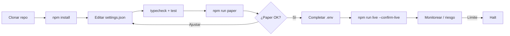
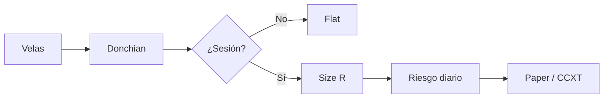

<p align="center">
  
</p>

# BloFin Day Trading Bot

<p align="center">
  <strong>Day-trading niche — multi-margin perps with R-multiple exits</strong><br/>
  blofin · paper + live · risk-gated · MIT
</p>

<p align="center">
  
  
  
  
</p>

<p align="center">
  Idiomas: [English](README.md) · [中文](README.zh.md) · [Deutsch](README.de.md) · **Español**
</p>

> **Palabras clave:** blofin trading bot · blofin day trading · blofin perps · multi margin futures bot

---

## Instantánea de rendimiento

Analítica demo del dashboard estático incluido (`npm run dashboard`). El banner y los diagramas de estrategia se mantienen.

<p align="center">
  
</p>

<p align="center">
  
</p>

<p align="center">
  
</p>

---

## Flujo del proyecto

Clonar → configurar → paper → credenciales → live. Riesgo siempre activo.



| | |
|--|--|
| `npm run paper` | Primero paper — sin API keys |
| `npm run dashboard` | Abrir dashboard de analítica local (estático) |
| `npm run live` | Requiere `--confirm-live` + credenciales API |

---

## Encaje con la plataforma

| | |
|--|--|
| Venue | blofin |
| Mercados | swap |
| Edge | Day-trading niche — multi-margin perps with R-multiple exits |
| Ejecución | CCXT live (sandbox) + paper |

---

## Estrategia de trading

BloFin se especializa en **day trading de perps multi-margen**. Este bot hace **breakouts estilo Donchian** solo en sesión UTC, sizea con **R-múltiplos** y limita **trades/día** para evitar revenge trading.

### Cómo funciona
- **Filtro de sesión**.
- **Breakout Donchian** con buffer.
- **Sizing R**.
- **TP/SL en R**.
- **Presupuesto diario**.
- **Helper de distancia a liquidación**.

### Cuándo aparece el edge
**Mejor régimen:** liquidez de apertura de sesión en BTC perps.

### Cuándo se rompe
**Falla cuando:** chop whipsaw, apalancamiento excesivo, maxTrades inflado.

### Parámetros clave (`settings.json`)
- `lookback`/`bufferPct`
- parámetros R
- sesión/maxTrades

### Notas de riesgo de la estrategia
- El day trading de perps es negativo tras fees sin disciplina.
- Mantén apalancamiento bajo.


---

## Diagrama de estrategia



---

## Arquitectura

```
src/
  config/     Zod settings + env loader
  strategy/   venue-specific engine
  broker/     paper + CCXT live adapters
  risk/       daily loss / drawdown / caps
  app/        runtime loop
  session/
  sizing/
  signals/
```

---

## Inicio rápido

```bash
cd blofin-day-trading-bot
npm install
npm run typecheck
npm test
npm run paper
```

### Live

```bash
cp .env.example .env
# set BLOFIN_API_KEY + BLOFIN_API_SECRET
# optional BLOFIN_PASSWORD / PASSPHRASE
npm run live
```

---

## Configuración

`settings.json` — strategy + risk + paper/live flags.  
`.env` — secrets only (see `.env.example`).

---

## Riesgo y seguridad

- Live refuses without `--confirm-live` and API credentials
- Prefer `live.sandbox: true` until proven
- Disable withdrawals on exchange API keys
- Daily loss / drawdown / notional caps + kill switch

---

## Aviso legal

Software educativo MIT — **no es asesoramiento financiero**. El trading en CEX puede causar pérdida total.

## Licencia

MIT — ver [LICENSE](LICENSE).
