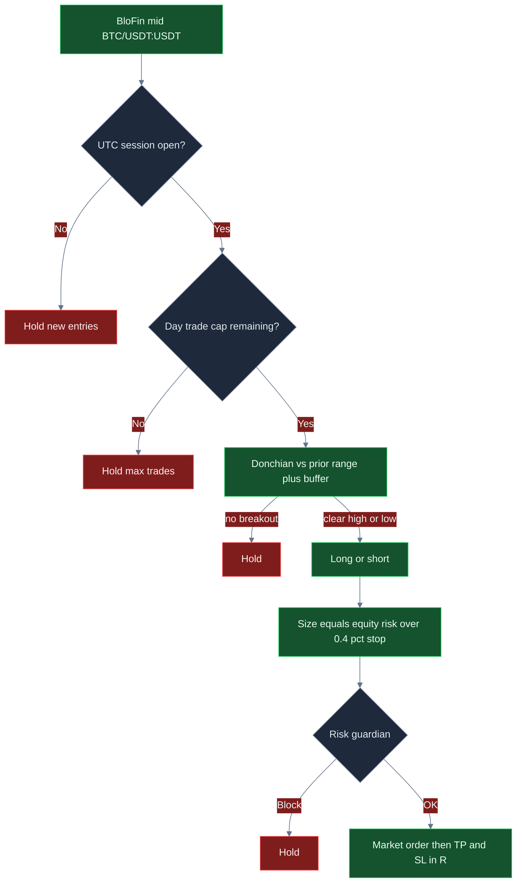

<p align="center">
  
</p>

# BloFin Day Trading Bot

<p align="center">
  <strong>Day-trade BloFin BTC perps like a session desk: buffered Donchian breaks, R-multiple exits, a hard daily trade cap, and dollar brakes in front of every market order.</strong><br/>
  blofin · BTC/USDT:USDT · swap · live CCXT · session-gated · MIT
</p>

<p align="center">
  
  
  
  
  
</p>

<p align="center">
  Languages: **English** · [中文](README.zh.md) · [Deutsch](README.de.md) · [Español](README.es.md)
</p>

> **Search keywords:** blofin trading bot · blofin day trading · blofin perps · blofin futures bot

BloFin is built for **intraday multi-margin perps**. This desk takes that seriously: enter only when price leaves a defined range *and* the UTC session is open, size as a fraction of equity against a 0.4% stop unit, take profit and stop in R, and refuse the next clip when the day budget, daily loss, or drawdown is already hot. Defaults are a starting desk — **the attractive ROI / win-rate / drawdown profile shows up after you tune buffer, R-multiples, trade cap, and clip size to your book.**

---

## Who it’s for

- Active crypto traders who already think in **sessions, breakouts, fees, and risk units** — not indicator tourism.
- Desks that want **BloFin USDT-M swap** (`BTC/USDT:USDT`) with a day window, not a 24/7 revenge loop.
- Operators who need a **live execution path** (CCXT market orders, `--confirm-live`, API keys) with a **kill switch and dollar brakes** in front of every intent.
- Tuners who will change `settings.json`, rerun, and hunt a buffer + R set that fits *their* fee tier and volatility — not people looking for a guaranteed money machine.

If you want a black-box “set and forget 100% win rate” product, this is not it. If you want a **real-market BloFin day desk you can actually configure**, keep reading.

---

## Strategy overview

One loop. Session first. Breakout second. R exits always on.

**Session gate.** New entries fire only while UTC hour is inside `sessionUtcStartHour`–`sessionUtcEndHour` (shipped **13–21**, US/EU overlap on BTC perps). Outside the window the desk holds new clips. Open trades still manage take-profit and stop. The counter resets on the UTC date so `maxTradesPerDay` is a real day budget, not a process lifetime.

**Donchian breakout.** The engine keeps a rolling window of mids (capped at `lookback`, default 18). It compares the latest print to the high/low of the *prior* bars. A long fires only if price clears that high by `bufferPct` (default `0.12`, applied as **0.12%**). A short fires if price breaks the low by the same buffer. Too small and you pay taker fees for noise; too large and you miss the session expansion.

**Size.** Risk dollars are `equity × riskPerTradePct / 100`. Clip notional is that risk divided by the **0.4%** stop unit, then capped at `maxPositionUsd`. On a $10k book with shipped `0.4%` risk, raw size wants the full book — the **$2,500** clip cap is what actually fills. Traders who want more punch raise `riskPerTradePct` **together with** `maxPositionUsd`.

**Exits.** Stop distance is `0.4%` of mid × `stopLossR`. Take-profit is the same unit × `takeProfitR`. Shipped **2R / 1R**. The exit order uses the **same notional** as the entry.

**Day budget.** After `maxTradesPerDay` fills (default **6**), new entries halt until the next UTC day.

**Risk gate.** Daily loss, peak drawdown, max notional, max position, and kill switch must all clear **before** placement.

```text
mid → session open? → day cap left? → Donchian + buffer → size vs 0.4% stop → risk guardian → BloFin market → TP/SL in R
```

---

## Why this edge can be powerful

BloFin perps are a day-trading venue. The point is **liquid hours, not overnight inventory**. A 0.12–0.16% buffer on BTC during the 13–21 UTC overlap can be a real range break. The same buffer in a thin Asian hour is often just a fee.

The R structure is the second point. Pure breakout desks get chopped. This desk defines the payoff *before* the fill: 1R out, 2R–2.5R in. You do not need a 70% win rate. You need winners that keep more than losers give back after 8 bps each way.

The third point is **the trade cap**. Six (or four) session clips is a policy. Raising `maxTradesPerDay` to 16 in the same window mostly buys fee drag. The cap is how a day book stays a day book.

The fourth point is **tunability**. Win rate, payoff, and drawdown are not locked to shipped defaults. Widen the buffer and you usually trade less and keep more of each winner. Lift `takeProfitR` and the payoff skew steepens. Raise clip only after the guardian still feels sane. That is how this desk goes from “quiet starter” to “this is worth running.”

Nothing here is a profit guarantee. The same knobs that unlock expectancy will wreck a book if you tighten the buffer into chop and size up into a one-way squeeze.

---

## Market regimes

| Regime | What the tape looks like | What the desk tends to do |
|---|---|---|
| **US/EU overlap, liquid BTC** | 13–21 UTC, real range expansions on BloFin perps | Breakouts can pay; session gate is doing its job |
| **Clean trend day inside the window** | High or low keeps breaking with follow-through | 2R–2.5R targets get hit; trade cap stops overtrading the same move |
| **Quiet, tight range** | Micro wiggles inside the lookback | Holds increase; a too-tight buffer is the failure mode |
| **Chop / fakeout tape** | Breaks that die inside 0.4% | Stops fire; widening `bufferPct` is the fix, not more size |
| **One-way squeeze after the open** | Session trend that does not pull back | First clips can bleed; daily-loss and drawdown brakes are the backstop |
| **Off-hours / thin prints** | Outside 13–21 UTC | New entries hold — by design |

**Thrives when:** liquid BTC perps, two-sided session flow, a buffer wide enough that expected move >> taker + slip, and a trade cap that keeps you from farming fees.

**Struggles when:** you run the shipped 0.12 buffer in a dead range, you lift `maxTradesPerDay` until the session is all churn, or your clip is at the cap while R is still 2/1 and fees eat the stop.

---

## Mathematical calculations

These are the relationships the desk is built on. Attractive expectancy is a **parameter choice**, not a default gift.

### Range breakout

With lookback \(n =\) `lookback` and buffer \(b =\) `bufferPct` / 100 (so `0.12` → **0.12%**):

$$
H_t = \max(\text{prior closes}),\quad L_t = \min(\text{prior closes})
$$

$$
\text{long} \iff C_t > H_t(1+b) \;\text{and session open},\qquad \text{short} \iff C_t < L_t(1-b) \;\text{and session open}
$$

A wider \(b\) cuts fakeouts and usually **raises payoff / lowers trade count**. A tighter \(b\) does the opposite.

### Stop unit and R-multiples

The engine uses a **0.4% of mid** stop unit (`STOP_UNIT_PCT`). With `stopLossR` / `takeProfitR`:

$$
\text{stop distance} = 0.004 \times \texttt{stopLossR} \times C_t
$$

$$
\text{take-profit distance} = 0.004 \times \texttt{takeProfitR} \times C_t
$$

Shipped 2R / 1R is a **+0.80% / −0.40%** design. Tuned 2.5R / 1R is **+1.00% / −0.40%**.

### Position size (as coded)

$$
N = \min\!\left(\frac{E \times \texttt{riskPerTradePct}/100}{0.004},\ \texttt{maxPositionUsd}\right)
$$

On $10k with `riskPerTradePct = 0.4`, raw \(N\) is $10,000. The shipped **$2,500** `maxPositionUsd` is the binding clip. **This is R sizing, then a hard dollar cap** — not ATR.

### Breakeven win rate

$$
\text{payoff} \approx \frac{\texttt{takeProfitR}}{\texttt{stopLossR}},\qquad
\text{breakeven win rate (before fees)} = \frac{SL}{TP + SL}
$$

For 2R vs 1R that floor is **33%**. For 2.5R vs 1R it is **29%**. Fees raise the floor — which is why buffer and the day cap matter. Round-trip 8 bps each way is **0.16%**, about **0.4R** against a 0.4% stop. After costs, 2.5R / 1R behaves closer to **~1.5 payoff** in dollars. You still do **not** need 70% wins. You need to stop paying that 0.4R in fakeouts.

### Expected value (conceptual)

$$
EV = p \cdot W - (1-p) \cdot L
$$

where \(p\) is win rate, \(W\) average win, \(L\) average loss. After costs:

$$
EV_{\text{net}} = EV - N \cdot (f + s)
$$

with \(f\) the fee fraction and \(s\) slippage fraction. Shipped paper `feeBps` is **8**, `slippageBps` is **5**.

### Why tuned math can look attractive

At 2.5R / 1R on a $4,000 clip, a ~55% win rate after 8 bps each way still prints roughly **+$8.40 EV per fill**. At shipped 2R / 1R on a $2,500 clip with a noisier 0.12 buffer, EV collapses toward **scratch** because fees sit on a short stop. **Same engine. Different knobs.**

---

## Statistical analysis

Results depend on settings, market regime, and how you tune. There is **no guaranteed profit**. Figures below are **scenario blocks** built from the strategy math (0.4% stop unit, R exits, 8 bps fees, session-selective vs noisy buffers) on a **$10,000 BTC/USDT:USDT** book. They are not a promise of a specific historical backtest.

### 1) Optimized scenario (illustrative) — lead

**Assumptions:** lookback `22`, buffer `0.16`, risk `0.5%` with `maxPositionUsd` **4000** so the clip is **$4,000**, `takeProfitR` `2.5` / `stopLossR` `1`, `maxTradesPerDay` `4`, session **13–21 UTC**, liquid BloFin BTC hours.

| Metric | Tuned scenario | What it means | Why a trader cares |
|---|---:|---|---|
| Sample | **120 trades** | ~4 selective clips × 30 session days | A day desk, not a 24/7 churn bot |
| Win rate | **55.0%** | A little more than half the clips work | At ~2.5R design you do **not** need 70% wins |
| Loss rate | **45.0%** | Losses are planned 1R, not surprises | Guardian + stop unit exist for this side |
| Avg win / avg loss | **$33.60 / $22.40** | After 8 bps each way on a $4k clip | Payoff is R minus fee drag — buffer is how you keep it |
| Payoff ratio | **1.50** | Avg win ÷ avg loss after costs | Fees turn 2.5R into ~1.5 in dollars; still tradeable |
| Expectancy / trade | **+$8.40** | Average dollar outcome per fill | Positive EV is the only reason to scale size |
| Net PnL / ROI | **+$1,008 / +10.1%** | Book after the sample | What you feel in equity — still scenario, still regime-dependent |
| Profit factor | **1.83** | Gross wins ÷ gross losses | Clearly above the default-like scratch book |
| Max drawdown | **4.9%** | Worst peak-to-trough in the sample | Under the 8% halt — room, not a license to size 10× |
| Return / risk | **~2.1** | +10.1% vs 4.9% DD | Smooth enough to sit through; not a lottery ticket |
| Best / worst trade | **+$34 / −$23** | Tail of the R distribution | Worst should look like ~1R plus fees, not a blow-up |
| Max win / loss streak | **7 / 4** | Clustering | Four losses in a row is why `maxDailyLossUsd` exists |
| Mix | **100% session breakouts** | No off-hours entries | The session gate *is* the filter |

**Plain English:** a wider buffer, a 2.5R target, four clips a day, and a clip large enough that 1% winners actually move the book. That is the profile worth hunting. Your live numbers will move with BTC volatility, BloFin fees, and how hard you push `maxPositionUsd`.

```text
TUNED SCENARIO (illustrative)     $10k book · 120 fills
Win rate  55.0%   Payoff  1.50   EV/trade  +$8.40
ROI      +10.1%   PF      1.83   Max DD     4.9%
```

### 2) Untuned / default-like contrast (illustrative)

Shipped-like: lookback `18`, buffer `0.12`, risk `0.4%` (**$2,500 clips** on $10k), 2R/1R, `maxTradesPerDay` `6`, same 8 bps.

| Metric | Default-like | vs tuned |
|---|---:|---|
| Sample | 60 fills, noisier | More activity per session, less quality |
| Win rate | 49.0% | Coin-flip after fakeouts |
| Payoff | 1.14 | 2R design, fees flatten it toward 1:1 |
| Expectancy | ~+$0.70 | Scratch after costs |
| ROI | ~+0.4% | Starter, not the ceiling |
| Profit factor | 1.10 | One bad session wipes the sample |
| Max drawdown | 7.2% | Close to the 8% halt |

**Takeaway:** defaults are a **safe on-ramp**, not the performance target. The jump from ~1.1 profit factor to ~1.8 in the tuned block is mostly **buffer + 2.5R + fewer clips + a clip the guardian actually allows** — not a different bot.

### Regime sketch (tuned scenario)

| Sleeve | Share of fills | Comment |
|---|---:|---|
| Session range-break | ~100% | Donchian + buffer is the only entry |
| Off-hours | 0% | Session gate holds |
| Cap-halted hours | skipped | `maxTradesPerDay = 4` is doing work |

---

## Charts

**Green = win / profit. Red = loss / weaker path.** Decision flow is GitHub Mermaid. Performance charts are 2D-rendered 3D-style PNGs so they display on GitHub.

### Decision logic



### Win / loss mix

<p align="center">
  
</p>

The pies look similar. **Payoff and clip size are what change.** Tuned keeps ~2.5R winners after fees (green); default-like lets a tight buffer and 2R design flatten the R (larger red share of the *dollar* book).

### Expectancy vs breakout buffer

<p align="center">
  
</p>

Too tight (`0.08`, red) overtrades BloFin noise. Shipped `0.12` is usable. **`0.16` is the illustrative green peak** before the buffer gets so wide that session fills starve.

### Equity path

<p align="center">
  
</p>

Green line: tuned scenario. Red line: default-like drift. Same venue, same Donchian — **different knobs**.

### Drawdown

<p align="center">
  
</p>

Red area is the underwater path. The dashed green line is the 8% guardian floor. The tuned path in this scenario stayed inside ~4.9%. If you triple size without widening buffer, that envelope will tag the halt.

---

## Parameter tuning — how to unlock better ROI, win rate, and loss control

Treat `settings.json` as a **desk**, not a trophy screen.

| If you want… | Turn this | In this direction | Watch this failure |
|---|---|---|---|
| Fewer fakeouts, better payoff | `bufferPct` | **0.12 → 0.16–0.20** | Too wide → almost no fills in the session |
| Stronger payoff skew | `takeProfitR` / `stopLossR` | e.g. **2.5 / 1.0** | Huge TP with a tight buffer → WR dies |
| Less fee churn | `maxTradesPerDay` | **6 → 4** | So tight you miss the only clean break |
| More punch per fill | `riskPerTradePct` **and** `maxPositionUsd` | Raise **together** | Size up alone → still capped at $2,500 |
| Tighter session | `sessionUtcStartHour` / `EndHour` | Keep **13–21**, or narrow | Widen into Asia thin prints → fakeouts |
| Tighter pain cap | `maxDailyLossUsd`, `maxDrawdownPct` | Slightly **tighter** while you learn | So tight the desk never recovers a normal day |

**Practical order of operations**

1. Leave size at the shipped cap. Change **buffer** until you are not trading every wiggle.
2. Change **takeProfitR** toward 2.5 until winners are worth the 0.4% stop.
3. Cut **maxTradesPerDay** until the session is selective, not busy.
4. Confirm BloFin taker fees match the 8 bps honesty in the paper cost model.
5. Only then raise `maxPositionUsd` (and risk %) toward the clip you actually want.
6. Stop when profit factor and drawdown both look like a book you can live with — not when a single session looks heroic.

---

## Risk management

These are the shipped brakes in `settings.json`. They sit in front of **every** order intent.

| Brake | Default | Behavior |
|---|---:|---|
| `sessionUtcStartHour` / `EndHour` | **13 / 21** | No new entries outside the UTC window |
| `maxTradesPerDay` | **6** | Day-desk budget; resets on UTC date |
| `maxDailyLossUsd` | **250** | Halt if daily PnL ≤ −$250 |
| `maxDrawdownPct` | **8** | Halt at 8% off peak equity |
| `maxNotionalUsd` | **5000** | Block clips above gross notional cap |
| `maxPositionUsd` | **2500** | Binding clip cap at shipped risk % |
| `killSwitch` | **false** | Set `true` to freeze all intents without redeploying |
| `riskPerTradePct` | **0.4** | R-sizer input; hits the $2,500 cap on $10k |
| Live arming | `confirmRequired` + `--confirm-live` | Live will not start on a casual `npm start` |
| Sandbox flag | `live.sandbox: true` | Keep on until the live path is proven on your keys |

Perps imply **liquidation risk** if you add exchange-side leverage. Clip caps are not a substitute for BloFin margin hygiene. Disable withdrawals on API keys. Never commit `.env`.

---

## End-to-end how it works

1. **Boot** — Load `settings.json` (Zod-validated) and optional `.env`.
2. **Mode** — `npm run paper` uses the paper broker (no keys). `npm run live -- --confirm-live` builds a CCXT BloFin client and places **market** orders on swap.
3. **Loop** — Fetch mid → update close window → session check → day-cap check → Donchian + buffer.
4. **Size** — Risk % / 0.4% stop unit, then `maxPositionUsd`.
5. **Guardian** — Kill switch, daily loss, drawdown, notional, position. Fail-closed: no “just this once.”
6. **Execute** — Paper fill or CCXT `createOrder` market on `BTC/USDT:USDT`. Open trades exit at TP or SL on the **same notional**.
7. **Ledger** — Each loop writes action, reason, PnL, equity. End-of-run summary prints trade count, PnL, win rate, and max consecutive losses.
8. **Dashboard** — `npm run dashboard` serves the local analytics UI on port 4173.

Paper and live share `src/strategy` and `src/risk`. Only `src/broker` switches. That is the production-style workflow: **same decision, different venue adapter**.

---

## Quick start

```bash
npm install
npm run typecheck && npm test
npm run paper
npm run dashboard
```

Dashboard: open `http://localhost:4173`.

Shipped session is **13–21 UTC**. Outside that window new entries hold (the day desk working). To exercise the loop any hour, temporarily set `sessionUtcStartHour` to `0` and `sessionUtcEndHour` to `24`.

### Live (BloFin)

```bash
cp .env.example .env
# set BLOFIN_API_KEY and BLOFIN_API_SECRET
# optional BLOFIN_PASSWORD / BLOFIN_PASSPHRASE
# disable withdrawals on the key; prefer IP whitelist
npm run live -- --confirm-live
```

Node **20+**. Strategy and risk live in `settings.json`. Secrets live only in `.env`.

---

## Key configuration knobs

Every row maps to `settings.json`. Strategy knobs shape the edge; risk knobs are hard brakes.

| Parameter | Location | Default | Meaning | Why it matters | Typical working range |
|---|---|---|---|---|---|
| `lookback` | strategy | `18` | Bars in the Donchian window | Memory of the range | 12 – 24 |
| `bufferPct` | strategy | `0.12` | Extra % beyond high/low (**0.12%**) | Fakeout filter — **#1 quality knob** | 0.10 – 0.20 |
| `riskPerTradePct` | strategy | `0.4` | Equity % risked to the 0.4% stop | Size dial (often capped) | 0.25 – 0.6 |
| `takeProfitR` | strategy | `2` | TP in R | Payoff skew | 1.5 – 2.5 |
| `stopLossR` | strategy | `1` | SL in R | Risk unit | 0.75 – 1.25 |
| `maxTradesPerDay` | strategy | `6` | Daily entry cap (UTC date) | Anti-churn / anti-revenge | 3 – 8 |
| `sessionUtcStartHour` | strategy | `13` | Session open (UTC) | Liquid-hours gate | 12 – 14 |
| `sessionUtcEndHour` | strategy | `21` | Session close (UTC) | No new entries after | 20 – 22 |
| `maxDailyLossUsd` | risk | `250` | Daily PnL halt ($) | Stops revenge trading | 150 – 350 on $10k |
| `maxDrawdownPct` | risk | `8` | Peak-to-trough halt (%) | Caps a regime shock | 5 – 12 |
| `maxNotionalUsd` | risk | `5000` | Gross notional cap | Blast radius | ≤ 50% equity |
| `maxPositionUsd` | risk | `2500` | Single-clip cap | **Binding size cap** on $10k | 2000 – 4000 |
| `killSwitch` | risk | `false` | Immediate freeze | Ops halt | flip `true` on incident |
| `symbol` | root | `BTC/USDT:USDT` | Traded pair | Stay on majors until proven | BTC/ETH USDT swap |
| `marketType` | root | `swap` | CCXT defaultType | BloFin USDT-M | swap |
| `feeBps` / `slippageBps` | paper | `8` / `5` | Cost model | Honesty of EV | match your VIP tier |

### Tuned-parameter example (starting point to hunt, not a certificate)

```json
{
  "risk": {
    "maxDailyLossUsd": 250,
    "maxDrawdownPct": 8,
    "maxNotionalUsd": 5000,
    "maxPositionUsd": 4000,
    "killSwitch": false
  },
  "strategy": {
    "type": "day",
    "lookback": 22,
    "bufferPct": 0.16,
    "riskPerTradePct": 0.5,
    "takeProfitR": 2.5,
    "stopLossR": 1,
    "maxTradesPerDay": 4,
    "sessionUtcStartHour": 13,
    "sessionUtcEndHour": 21
  }
}
```

Shipped defaults stay in `settings.json` as the conservative on-ramp. Copy the block above when you are ready to search for the **tuned** profile from the Statistical Analysis section.

---

## Example trade walkthrough

**Setup.** BloFin `BTC/USDT:USDT`, $10,000 equity, tuned-style buffer `0.16`, lookback `22`, risk `0.5%`, `maxPositionUsd` `4000`. Guardian: −$250 day / 8% DD. Session 13–21 UTC. Four-trade day cap.

**Tape.** 15:40 UTC. The last 22 mids built a range with high \(H\). The next mid prints **0.18% above \(H\)**. Session is open. Day count is 1/4. Donchian long fires.

**Size.** Risk = $50. Stop unit = 0.4%. Raw \(N = 50 / 0.004 = \$12{,}500\), then cap **$4,000**. Guardian sees notional under $5,000, daily PnL not halted, kill switch off → **OK**.

**Fill.** Market buy on BloFin swap. Reason tag: `breakout_long`. Stop sits 0.4% below; take-profit 1.0% above (2.5R). Fee marks at 8 bps (~$3.20 on this clip).

**Exit.** Price reaches the 2.5R target. The desk sells **$4,000** notional (same clip, not a stub). Ledger books ~+$33.60 after the exit fee.

**Alternate loop (session hold).** Same break, but the clock is **06:10 UTC**. Session gate fails. Action: `hold` / `session_closed`. That skip is the day desk.

**Alternate loop (cap).** Fourth fill already taken. Fifth breakout in the same UTC day → `hold` / `max_trades`.

**Bad day.** Three 1R losers on a choppy open. Daily PnL hits −$250 → guardian **halts**. You do not “make it back” after 21:00. That is the product working.

---

## Download it. Tune it. Find your best desk.

Clone the repo. Run the tests. Start on BloFin BTC/USDT swap with the shipped brakes on. Then move **buffer**, **takeProfitR**, **maxTradesPerDay**, and **maxPositionUsd** until the book looks like the tuned scenario you actually want to live with — higher payoff, fewer junk breaks, drawdown still inside the guardian.

The edge is not a secret indicator. It is **BloFin session liquidity + a buffer you chose + R you can live with + brakes that fire**. The ceiling is in `settings.json`. Go find it.

```bash
npm install && npm test && npm run paper
```

**License:** MIT — see [LICENSE](LICENSE).
