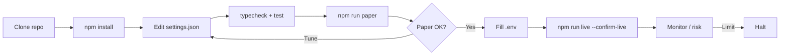
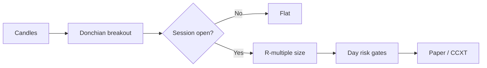

<p align="center">
  
</p>

# BloFin Day Trading Bot

<p align="center">
  <strong>Day-trading niche — multi-margin perps with R-multiple exits</strong><br/>
  blofin · paper + live · risk-gated · MIT
</p>

<p align="center">
  
  
  
  
</p>

<p align="center">
  Languages: **English** · [中文](README.zh.md) · [Deutsch](README.de.md) · [Español](README.es.md)
</p>

> **Search keywords:** blofin trading bot · blofin day trading · blofin perps · multi margin futures bot

---

## Performance snapshot

Demo analytics from the included static dashboard (`npm run dashboard`). Banners and strategy diagrams stay above/below.

<p align="center">
  
</p>

<p align="center">
  
</p>

<p align="center">
  
</p>

---

## Project workflow

Clone → configure → paper → credentials → live. Risk always on.



| | |
|--|--|
| `npm run paper` | Paper first — no API keys |
| `npm run dashboard` | Open local analytics dashboard (static) |
| `npm run live` | Requires `--confirm-live` + API credentials |

---

## Platform fit

| | |
|--|--|
| Venue | blofin |
| Markets | swap |
| Edge | Day-trading niche — multi-margin perps with R-multiple exits |
| Execution | CCXT live (sandbox preferred) + paper simulator |

---

## Trading strategy

BloFin’s niche is **day-trading multi-margin perps**. This bot runs a **Donchian-style breakout** only inside a configured UTC session, sizes with **R-multiples** (risk a fixed equity % to the stop distance), and enforces **max trades/day** so a hot tape cannot turn into revenge trading.

### How it works
- **Session filter** — Trade only within `sessionUtcStartHour`–`sessionUtcEndHour` (paper demos may keep session open for activity).
- **Donchian breakout** — Leave prior lookback high/low by `bufferPct`.
- **R sizing** — `size ≈ (equity × riskPerTradePct) / stopDistance`.
- **Exits** — Take-profit at `takeProfitR` × stop; stop at `stopLossR` × stop.
- **Day budget** — Halt new entries after `maxTradesPerDay`.
- **Scenario helper** — Liquidation-distance estimates for leverage sanity checks.

### When the edge appears
**Best regime:** session-open liquidity on BTC perps with clean range expansions. Avoid low-liquidity off-hours and event spikes without wider stops.

### When it breaks down
**Fails when:** chop whipsaws breakouts, oversized leverage collapses R math, or traders raise maxTrades until risk limits are meaningless.

### Key parameters (`settings.json`)
- `lookback`, `bufferPct`
- `riskPerTradePct`, `takeProfitR`, `stopLossR`
- `maxTradesPerDay`, session hours

### Strategy-specific risk notes
- Day trading perps is a negative-sum game after fees without discipline.
- Keep leverage low single-digits until proven.


---

## Strategy diagram



---

## Architecture

```
src/
  config/     Zod settings + env loader
  strategy/   venue-specific engine
  broker/     paper + CCXT live adapters
  risk/       daily loss / drawdown / caps
  app/        runtime loop
  session/
  sizing/
  signals/
```

---

## Quickstart

```bash
cd blofin-day-trading-bot
npm install
npm run typecheck
npm test
npm run paper
```

### Live

```bash
cp .env.example .env
# set BLOFIN_API_KEY + BLOFIN_API_SECRET
# optional BLOFIN_PASSWORD / PASSPHRASE
npm run live
```

---

## Configuration

`settings.json` — strategy + risk + paper/live flags.  
`.env` — secrets only (see `.env.example`).

---

## Risk & safety

- Live refuses without `--confirm-live` and API credentials
- Prefer `live.sandbox: true` until proven
- Disable withdrawals on exchange API keys
- Daily loss / drawdown / notional caps + kill switch

---

## Disclaimer

Educational MIT software — **not financial advice**. CEX trading can cause total loss of capital.

## License

MIT — see [LICENSE](LICENSE).
