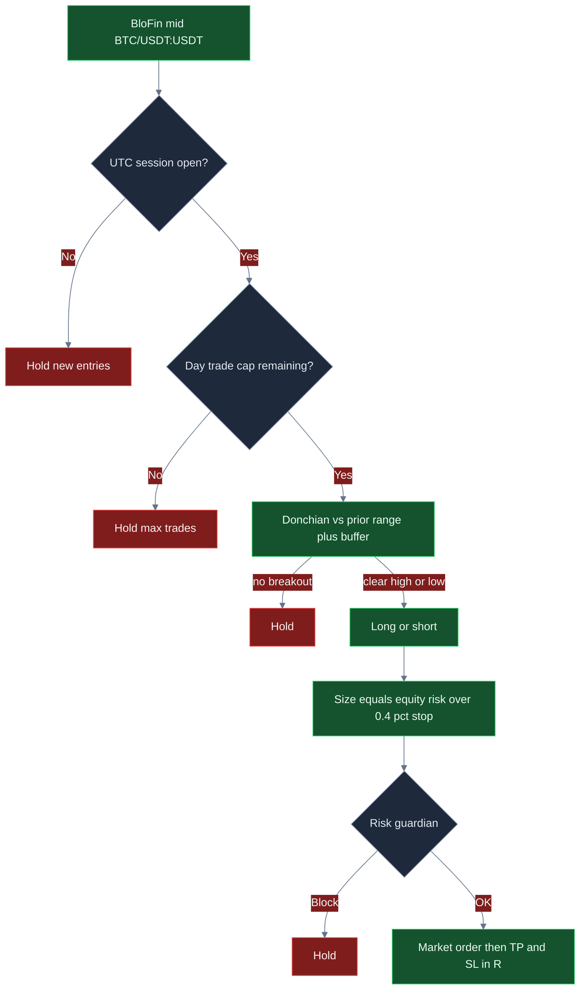
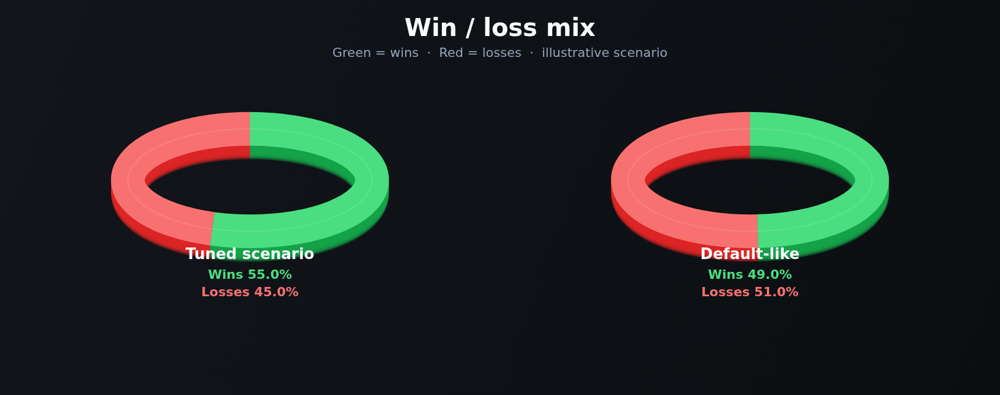
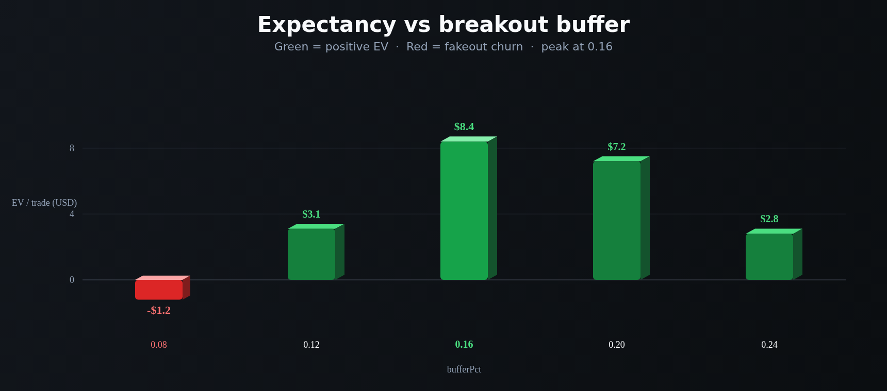
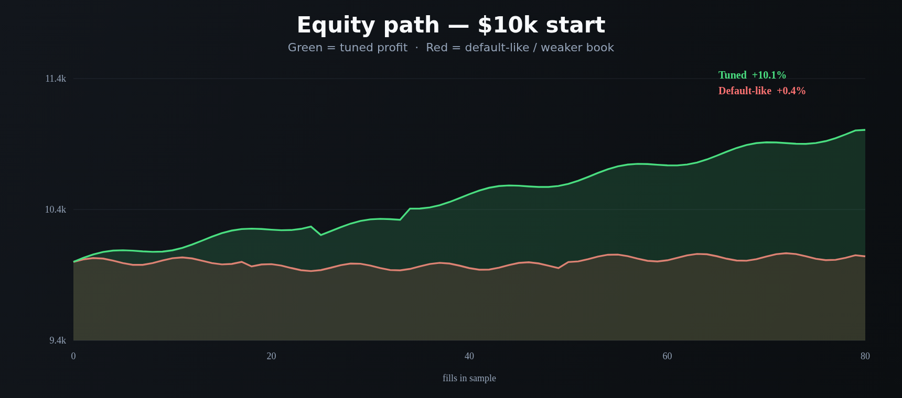
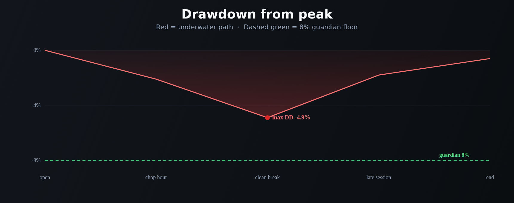

<p align="center">
  
</p>

# BloFin 日内交易机器人

<p align="center">
  <strong>像时段交易台一样做 BloFin BTC 永续：带缓冲突破的 Donchian、R 倍数出场、硬日内笔数上限，以及每笔市价单前的美元刹车。</strong><br/>
  blofin · BTC/USDT:USDT · 永续 · 实盘 CCXT · 时段门控 · MIT
</p>

<p align="center">
  
  
  
  
  
</p>

<p align="center">
  语言: [English](README.md) · **中文** · [Deutsch](README.de.md) · [Español](README.es.md)
</p>

> **搜索关键词:** blofin trading bot · blofin day trading · blofin perps · blofin futures bot

BloFin 是为 **日内多保证金永续** 做的。本交易台认真对待这一点：只有价格离开既定区间 *并且* UTC 时段开着才进场，按权益的一截去对 0.4% 止损单位定仓，用 R 做止盈止损，当天预算、日亏损或回撤已经烫了就拒绝下一笔。默认参数只是起点——**有吸引力的 ROI / 胜率 / 回撤，来自你把缓冲、R 倍数、笔数上限和仓位，调到自己的账本上。**

---

## 适合谁

- 已经按 **时段、突破、手续费、风险单位** 思考的交易者——不是指标观光客。
- 要在 **BloFin U 本位永续**（`BTC/USDT:USDT`）上跑日内窗口，而不是 24/7 报复循环的交易台。
- 需要 **实盘执行路径**（CCXT 市价单、`--confirm-live`、API 密钥），并且每笔意图前都有 **熔断 + 美元刹车** 的人。
- 会改 `settings.json`、重跑、寻找匹配自己费率档与波动的缓冲 + R 组合的人——不是来找“保证赚钱机器”的人。

如果你要的是黑盒“一键 100% 胜率”，这不是它。如果你要的是 **可以真正配置的 BloFin 日内台**，继续往下读。

---

## 策略概览

一个循环。先时段。再突破。R 出场始终开着。

**时段闸门。** 只有 UTC 小时落在 `sessionUtcStartHour`–`sessionUtcEndHour`（出厂 **13–21**，BTC 永续的美欧重叠）时才开新仓。窗口外对新仓位 hold。已开仓仍管理止盈止损。计数器按 UTC 日期重置，所以 `maxTradesPerDay` 是真正的日预算，不是进程寿命。

**Donchian 突破。** 引擎保留滚动中间价窗口（上限 `lookback`，默认 18）。用最新价对比 *前序* K 的高低点。只有价格高出该高点 `bufferPct`（默认 `0.12`，按 **0.12%** 用）才做多；跌破低点同样缓冲才做空。太小就给噪声付吃单费；太大就错过时段扩张。

**定仓。** 风险美元是 `equity × riskPerTradePct / 100`。仓位名义是该风险除以 **0.4%** 止损单位，再封顶 `maxPositionUsd`。$10k 账、出厂 `0.4%` 风险时，原始仓位想打满整本账——真正成交的是 **$2,500** 单笔上限。想加力度，请把 `riskPerTradePct` **和** `maxPositionUsd` 一起抬。

**出场。** 止损距离是中间价的 `0.4%` × `stopLossR`。止盈是同一单位 × `takeProfitR`。出厂 **2R / 1R**。平仓单用 **与开仓相同的名义**。

**日预算。** 达到 `maxTradesPerDay`（默认 **6**）后，新开仓停到下一个 UTC 日。

**风控闸门。** 日亏损、峰值回撤、名义上限、单笔上限、熔断开关，必须在下单 **之前** 全部通过。

```text
中间价 → 时段开着? → 日额度还剩? → Donchian + 缓冲 → 按 0.4% 止损定仓 → 风控主管 → BloFin 市价 → R 止盈/止损
```

---

## 为什么这个优势可以很强

BloFin 永续是日内场地。重点是 **流动时段，不是隔夜库存**。13–21 UTC 重叠里，BTC 上 0.12–0.16% 的缓冲可以是真的区间突破。同样的缓冲在亚洲薄时段，往往只是手续费。

R 结构是第二点。纯突破台容易被来回打。这张台在成交 *之前* 就定好赔率：1R 出局，2R–2.5R 进账。你不需要 70% 胜率。你需要赢家在双边 8 bps 之后，仍比输家吐回去的多。

第三点是 **笔数上限**。一天六笔（或四笔）是政策。把 `maxTradesPerDay` 抬到 16，同一窗口里多买的主要是手续费。上限让日内账还是日内账。

第四点是 **可调性**。胜率、赔率、回撤没有锁死在出厂默认。加宽缓冲通常交易更少、每笔赢家留得更多。抬 `takeProfitR` 让赔率更陡。只有风控仍然觉得安全时才加仓。这就是从“安静起点”走到“值得跑”的路径。

这里没有任何利润保证。同样这些旋钮，如果你把缓冲收进震荡、再对着单边挤压加仓，也会毁掉一本账。

---

## 市场状态

| 状态 | 盘口长什么样 | 交易台倾向做什么 |
|---|---|---|
| **美欧重叠、BTC 有流动性** | 13–21 UTC，BloFin 永续上真实区间扩张 | 突破可以兑现；时段闸门在干活 |
| **窗口内干净趋势日** | 高点或低点持续突破并有跟随 | 2R–2.5R 目标打到；笔数上限阻止同一波里过度交易 |
| **安静、窄区间** | 回看窗口里的微幅抖动 | hold 变多；缓冲太紧是失败模式 |
| **震荡 / 假突破** | 突破在 0.4% 内死亡 | 止损触发；该加宽 `bufferPct`，不是加仓 |
| **开盘后单边挤压** | 时段趋势不回撤 | 前几笔可能失血；日亏损和回撤刹车是后盾 |
| **非时段 / 薄打印** | 13–21 UTC 之外 | 新开仓 hold——这是设计 |

**适合：** 流动 BTC 永续、双向时段流量、缓冲宽到预期波动 >> 吃单+滑点、笔数上限让你不会去刷手续费。

**吃力：** 在死区间里跑出厂 0.12 缓冲、把 `maxTradesPerDay` 抬到整段都是换手、或者仓位顶着上限而 R 仍是 2/1、手续费吃掉止损。

---

## 数学计算

这些是交易台建立在上面的关系。有吸引力的期望值是 **参数选择**，不是默认赠品。

### 区间突破

回看 \(n =\) `lookback`，缓冲 \(b =\) `bufferPct` / 100（所以 `0.12` → **0.12%**）：

$$
H_t = \max(\text{prior closes}),\quad L_t = \min(\text{prior closes})
$$

$$
\text{long} \iff C_t > H_t(1+b) \;\text{and session open},\qquad \text{short} \iff C_t < L_t(1-b) \;\text{and session open}
$$

更宽的 \(b\) 减少假突破，通常 **提高赔率 / 降低笔数**。更紧则相反。

### 止损单位与 R 倍数

引擎使用 **中间价的 0.4%** 作为止损单位（`STOP_UNIT_PCT`）。配合 `stopLossR` / `takeProfitR`：

$$
\text{stop distance} = 0.004 \times \texttt{stopLossR} \times C_t
$$

$$
\text{take-profit distance} = 0.004 \times \texttt{takeProfitR} \times C_t
$$

出厂 2R / 1R 是 **+0.80% / −0.40%** 设计。优化 2.5R / 1R 是 **+1.00% / −0.40%**。

### 仓位（按代码）

$$
N = \min\!\left(\frac{E \times \texttt{riskPerTradePct}/100}{0.004},\ \texttt{maxPositionUsd}\right)
$$

$10k、`riskPerTradePct = 0.4` 时，原始 \(N\) 是 $10,000。出厂 **$2,500** 的 `maxPositionUsd` 才是真正成交的仓位。**这是 R 定仓，再加硬美元上限**——不是 ATR。

### 盈亏平衡胜率

$$
\text{payoff} \approx \frac{\texttt{takeProfitR}}{\texttt{stopLossR}},\qquad
\text{breakeven win rate (before fees)} = \frac{SL}{TP + SL}
$$

2R 对 1R 的地板是 **33%**。2.5R 对 1R 是 **29%**。手续费抬高地板——所以缓冲和日上限重要。双边各 8 bps 是 **0.16%**，相对 0.4% 止损大约 **0.4R**。成本之后，2.5R / 1R 在美元上更接近 **约 1.5 赔率**。你仍然 **不需要** 70% 胜率。你需要停止用假突破去付那 0.4R。

### 期望值（概念）

$$
EV = p \cdot W - (1-p) \cdot L
$$

其中 \(p\) 是胜率，\(W\) 平均盈利，\(L\) 平均亏损。成本之后：

$$
EV_{\text{net}} = EV - N \cdot (f + s)
$$

\(f\) 是费率，\(s\) 是滑点。出厂纸面 `feeBps` 为 **8**，`slippageBps` 为 **5**。

### 为什么调参后的数学可以好看

2.5R / 1R、$4,000 仓、约 55% 胜率、双边 8 bps 之后，大约是 **每笔 +$8.40 EV**。出厂 2R / 1R、$2,500 仓、更噪的 0.12 缓冲，EV 会塌向 **打平**，因为手续费坐在很短的止损上。**同一台引擎。不同旋钮。**

---

## 统计分析

结果取决于参数、市场状态和你怎么调。**没有保证利润**。下面是根据策略数学（0.4% 止损单位、R 出场、8 bps 手续费、时段筛选 vs 嘈杂缓冲）在 **$10,000 BTC/USDT:USDT** 账上构建的 **情景块**。不是某次历史回测的承诺。

### 1) 优化情景（示意）——先看这个

**假设：** lookback `22`，缓冲 `0.16`，风险 `0.5%` 且 `maxPositionUsd` **4000** 所以仓位是 **$4,000**，`takeProfitR` `2.5` / `stopLossR` `1`，`maxTradesPerDay` `4`，时段 **13–21 UTC**，BloFin BTC 流动时段。

| 指标 | 优化情景 | 含义 | 交易者为什么在意 |
|---|---:|---|---|
| 样本 | **120 笔** | 约 4 笔精选 × 30 个时段日 | 日内台，不是 24/7 刷单 |
| 胜率 | **55.0%** | 一半多一点的仓位有效 | 在约 2.5R 设计下 **不需要** 70% 胜率 |
| 亏损率 | **45.0%** | 亏损是计划中的 1R，不是意外 | 风控 + 止损单位就是为这一边准备的 |
| 平均盈 / 平均亏 | **$33.60 / $22.40** | $4k 仓双边 8 bps 之后 | 赔率是 R 减去费用拖累——缓冲决定你能不能保住它 |
| 赔率 | **1.50** | 成本后均盈 ÷ 均亏 | 费用把 2.5R 变成美元上约 1.5；仍然可交易 |
| 期望值 / 笔 | **+$8.40** | 每笔平均美元结果 | 正 EV 才是加仓的理由 |
| 净盈亏 / ROI | **+$1,008 / +10.1%** | 样本后的账 | 你在权益上感受到的——仍是情景，仍依赖状态 |
| 盈亏比 | **1.83** | 毛盈利 ÷ 毛亏损 | 明显高于偏默认的打平账 |
| 最大回撤 | **4.9%** | 样本中最差峰谷 | 在 8% 熔断之下——有空间，不是 10 倍加仓许可证 |
| 收益 / 风险 | **~2.1** | +10.1% vs 4.9% DD | 平滑到坐得住；不是彩票 |
| 最佳 / 最差一笔 | **+$34 / −$23** | R 分布的尾巴 | 最差应像 1R 加费用，不是爆仓 |
| 最长连胜 / 连亏 | **7 / 4** | 聚集 | 连亏四笔就是 `maxDailyLossUsd` 存在的原因 |
| 构成 | **100% 时段突破** | 没有非时段进场 | 时段闸门 *就是* 过滤器 |

**人话：** 更宽的缓冲、2.5R 目标、一天四笔、仓位大到 1% 的赢家真能推动账本。这就是值得去找的画像。你的实盘数字会随 BTC 波动、BloFin 费率和你把 `maxPositionUsd` 推多狠而动。

```text
TUNED SCENARIO (illustrative)     $10k book · 120 fills
Win rate  55.0%   Payoff  1.50   EV/trade  +$8.40
ROI      +10.1%   PF      1.83   Max DD     4.9%
```

### 2) 未调 / 偏默认对照（示意）

偏出厂：lookback `18`，缓冲 `0.12`，风险 `0.4%`（$10k 上 **$2,500 仓**），2R/1R，`maxTradesPerDay` `6`，同样 8 bps。

| 指标 | 偏默认 | vs 优化 |
|---|---:|---|
| 样本 | 60 笔，更噪 | 每个时段更忙，质量更低 |
| 胜率 | 49.0% | 假突破之后接近抛硬币 |
| 赔率 | 1.14 | 2R 设计，费用把它压向 1:1 |
| 期望值 | ~+$0.70 | 成本后接近打平 |
| ROI | ~+0.4% | 起点，不是天花板 |
| 盈亏比 | 1.10 | 一个坏时段就能抹掉样本 |
| 最大回撤 | 7.2% | 靠近 8% 熔断 |

**要点：** 默认是 **安全坡道**，不是业绩目标。盈亏比从约 1.1 跳到约 1.8，主要是 **缓冲 + 2.5R + 更少笔数 + 风控真正允许的仓位**——不是另一台机器人。

### 状态草图（优化情景）

| 分桶 | 成交占比 | 说明 |
|---|---:|---|
| 时段区间突破 | ~100% | Donchian + 缓冲是唯一进场 |
| 非时段 | 0% | 时段闸门 hold |
| 触达上限的小时 | 跳过 | `maxTradesPerDay = 4` 在干活 |

---

## 图表

**绿色 = 盈利 / 强路径。红色 = 亏损 / 弱路径。** 决策流是 GitHub Mermaid。业绩图是带一点 3D 深度的 2D PNG，以便在 GitHub 上显示。

### 决策逻辑



### 胜负构成

<p align="center">
  
</p>

饼图看起来差不多。**变的是赔率和仓位。** 优化情景在费用后保住约 2.5R 赢家（绿）；偏默认让紧缓冲和 2R 设计把 R 压扁（美元账上红的份额更大）。

### 期望值 vs 突破缓冲

<p align="center">
  
</p>

太紧（`0.08`，红）会在 BloFin 噪声上过度交易。出厂 `0.12` 能用。**`0.16` 是示意中的绿色峰值**，再宽时段成交就会饿死。

### 权益路径

<p align="center">
  
</p>

绿线：优化情景。红线：偏默认漂移。同一交易所，同一套 Donchian——**不同旋钮**。

### 回撤

<p align="center">
  
</p>

红色区域是水下路径。绿色虚线是 8% 风控地板。该情景里优化路径停在约 4.9%。如果你不加宽缓冲就把仓位乘三，这条包络会撞上熔断。

---

## 参数调优 — 如何解锁更好的 ROI、胜率和亏损控制

把 `settings.json` 当成 **交易台**，不是奖杯屏。

| 如果你想… | 拧这个 | 往这个方向 | 盯住这种失败 |
|---|---|---|---|
| 更少假突破、更好赔率 | `bufferPct` | **0.12 → 0.16–0.20** | 太宽 → 时段里几乎没成交 |
| 更陡的赔率 | `takeProfitR` / `stopLossR` | 例如 **2.5 / 1.0** | 巨大止盈配紧缓冲 → 胜率死亡 |
| 更少手续费换手 | `maxTradesPerDay` | **6 → 4** | 太紧会错过唯一干净突破 |
| 每笔更有力度 | `riskPerTradePct` **和** `maxPositionUsd` | **一起** 抬 | 只加风险% → 仍卡在 $2,500 |
| 更紧的时段 | `sessionUtcStartHour` / `EndHour` | 保持 **13–21**，或收窄 | 扩进亚洲薄盘 → 假突破 |
| 更紧的痛感上限 | `maxDailyLossUsd`, `maxDrawdownPct` | 学习期略 **收紧** | 太紧则正常日也翻不了身 |

**实操顺序**

1. 仓位先留在出厂上限。改 **缓冲**，直到你不是每个抖动都在交易。
2. 把 **takeProfitR** 推向 2.5，直到赢家配得上 0.4% 止损。
3. 把 **maxTradesPerDay** 砍到时段是精选，而不是忙碌。
4. 确认 BloFin 吃单费和纸面成本模型里的 8 bps 对得上。
5. 然后才把 `maxPositionUsd`（和风险%）抬到你真正想要的仓位。
6. 停在盈亏比和回撤都像一本你能坐住的账——而不是某一时段看起来很英雄的时候。

---

## 风险管理

这些是 `settings.json` 里出厂的刹车。它们坐在 **每一笔** 下单意图前面。

| 刹车 | 默认 | 行为 |
|---|---:|---|
| `sessionUtcStartHour` / `EndHour` | **13 / 21** | UTC 窗口外不开新仓 |
| `maxTradesPerDay` | **6** | 日内预算；按 UTC 日期重置 |
| `maxDailyLossUsd` | **250** | 日盈亏 ≤ −$250 则停 |
| `maxDrawdownPct` | **8** | 离峰值权益 8% 停 |
| `maxNotionalUsd` | **5000** | 超过总名义则拦截 |
| `maxPositionUsd` | **2500** | 出厂风险%下的绑定仓位上限 |
| `killSwitch` | **false** | 设 `true` 即可冻结全部意图，不用重新部署 |
| `riskPerTradePct` | **0.4** | R 定仓输入；$10k 上撞 $2,500 上限 |
| 实盘武装 | `confirmRequired` + `--confirm-live` | 随手 `npm start` 不会开实盘 |
| 沙盒开关 | `live.sandbox: true` | 在你的密钥上把实盘路径跑通之前保持打开 |

永续意味着如果你在交易所侧加杠杆，就有 **强平风险**。仓位上限不能替代 BloFin 保证金卫生。API 密钥禁用提现。永远不要提交 `.env`。

---

## 端到端如何工作

1. **启动** — 加载 `settings.json`（Zod 校验）和可选 `.env`。
2. **模式** — `npm run paper` 用纸面经纪商（无需密钥）。`npm run live -- --confirm-live` 构建 CCXT BloFin 客户端，在永续上挂 **市价单**。
3. **循环** — 取中间价 → 更新收盘窗口 → 时段检查 → 日上限检查 → Donchian + 缓冲。
4. **定仓** — 风险% / 0.4% 止损单位，再 `maxPositionUsd`。
5. **主管** — 熔断、日亏损、回撤、名义、仓位。失败即关：没有“就这一次”。
6. **执行** — 纸面成交或 CCXT `createOrder` 市价打 `BTC/USDT:USDT`。开仓按 **同一名义** 在止盈或止损平掉。
7. **账本** — 每轮写入动作、原因、盈亏、权益。结束摘要打印笔数、盈亏、胜率和最长连亏。
8. **仪表盘** — `npm run dashboard` 在 4173 端口提供本地分析 UI。

纸面和实盘共享 `src/strategy` 和 `src/risk`。只有 `src/broker` 切换。这就是生产风格工作流：**同一套决策，不同场地适配器**。

---

## 快速开始

```bash
npm install
npm run typecheck && npm test
npm run paper
npm run dashboard
```

仪表盘：打开 `http://localhost:4173`。

出厂时段是 **13–21 UTC**。窗口外新开仓会 hold（日内台在工作）。若要在任意小时跑通循环，可临时把 `sessionUtcStartHour` 设为 `0`、`sessionUtcEndHour` 设为 `24`。

### 实盘（BloFin）

```bash
cp .env.example .env
# set BLOFIN_API_KEY and BLOFIN_API_SECRET
# optional BLOFIN_PASSWORD / BLOFIN_PASSPHRASE
# disable withdrawals on the key; prefer IP whitelist
npm run live -- --confirm-live
```

需要 Node **20+**。策略和风控在 `settings.json`。密钥只放 `.env`。

---

## 关键配置旋钮

每一行都对应 `settings.json`。策略旋钮塑造优势；风控旋钮是硬刹车。

| 参数 | 位置 | 默认 | 含义 | 为什么重要 | 典型工作区间 |
|---|---|---|---|---|---|
| `lookback` | strategy | `18` | Donchian 窗口根数 | 区间记忆 | 12 – 24 |
| `bufferPct` | strategy | `0.12` | 高低点外额外 %（**0.12%**） | 假突破过滤 — **#1 质量旋钮** | 0.10 – 0.20 |
| `riskPerTradePct` | strategy | `0.4` | 对 0.4% 止损风险的权益% | 仓位旋钮（常被上限卡住） | 0.25 – 0.6 |
| `takeProfitR` | strategy | `2` | 止盈 R | 赔率倾斜 | 1.5 – 2.5 |
| `stopLossR` | strategy | `1` | 止损 R | 风险单位 | 0.75 – 1.25 |
| `maxTradesPerDay` | strategy | `6` | 日开仓上限（UTC 日期） | 反换手 / 反复仇 | 3 – 8 |
| `sessionUtcStartHour` | strategy | `13` | 时段开（UTC） | 流动时段闸门 | 12 – 14 |
| `sessionUtcEndHour` | strategy | `21` | 时段关（UTC） | 之后不开新仓 | 20 – 22 |
| `maxDailyLossUsd` | risk | `250` | 日盈亏熔断（$） | 停止报复交易 | $10k 上 150 – 350 |
| `maxDrawdownPct` | risk | `8` | 峰谷熔断（%） | 盖住状态冲击 | 5 – 12 |
| `maxNotionalUsd` | risk | `5000` | 总名义上限 | 爆炸半径 | ≤ 50% 权益 |
| `maxPositionUsd` | risk | `2500` | 单笔上限 | **$10k 上绑定仓位上限** | 2000 – 4000 |
| `killSwitch` | risk | `false` | 立即冻结 | 运维急停 | 出事时翻 `true` |
| `symbol` | root | `BTC/USDT:USDT` | 交易对 | 未验证前留在主流 | BTC/ETH USDT 永续 |
| `marketType` | root | `swap` | CCXT defaultType | BloFin U 本位 | swap |
| `feeBps` / `slippageBps` | paper | `8` / `5` | 成本模型 | EV 的诚实度 | 匹配你的 VIP 档 |

### 调参示例（寻找起点，不是证书）

```json
{
  "risk": {
    "maxDailyLossUsd": 250,
    "maxDrawdownPct": 8,
    "maxNotionalUsd": 5000,
    "maxPositionUsd": 4000,
    "killSwitch": false
  },
  "strategy": {
    "type": "day",
    "lookback": 22,
    "bufferPct": 0.16,
    "riskPerTradePct": 0.5,
    "takeProfitR": 2.5,
    "stopLossR": 1,
    "maxTradesPerDay": 4,
    "sessionUtcStartHour": 13,
    "sessionUtcEndHour": 21
  }
}
```

出厂默认留在 `settings.json` 里当保守坡道。准备寻找统计分析里的 **优化** 画像时，复制上面这块。

---

## 示例成交走查

**设置。** BloFin `BTC/USDT:USDT`，$10,000 权益，优化风格缓冲 `0.16`，lookback `22`，风险 `0.5%`，`maxPositionUsd` `4000`。风控：日 −$250 / 回撤 8%。时段 13–21 UTC。一天四笔上限。

**盘口。** 15:40 UTC。最近 22 根中间价形成区间，高点 \(H\)。下一根中间价打到 **高于 \(H\) 0.18%**。时段开着。日计数 1/4。Donchian 做多触发。

**定仓。** 风险 = $50。止损单位 = 0.4%。原始 \(N = 50 / 0.004 = \$12{,}500\)，然后封顶 **$4,000**。主管看到名义低于 $5,000、日盈亏未熔断、开关关闭 → **OK**。

**成交。** BloFin 永续市价买入。原因标签：`breakout_long`。止损在下方 0.4%；止盈在上方 1.0%（2.5R）。费用按 8 bps 记账（这笔约 $3.20）。

**出场。** 价格打到 2.5R 目标。交易台卖出 **$4,000** 名义（同一仓位，不是残单）。账本在出场费后记约 +$33.60。

**另一轮（时段 hold）。** 同样的突破，但时钟是 **06:10 UTC**。时段闸门失败。动作：`hold` / `session_closed`。这一跳过就是日内台。

**另一轮（上限）。** 当天第四笔已经成交。同一个 UTC 日第五次突破 → `hold` / `max_trades`。

**坏日子。** 震荡开盘连吃三笔 1R。日盈亏撞上 −$250 → 主管 **停机**。你不会在 21:00 之后“赚回来”。这就是产品在工作。

---

## 下载它。调它。找到你最好的交易台。

克隆仓库。跑测试。在 BloFin BTC/USDT 永续上带着出厂刹车开始。然后拧 **缓冲**、**takeProfitR**、**maxTradesPerDay** 和 **maxPositionUsd**，直到账本看起来像你真正想坐进去的优化情景——更高赔率、更少垃圾突破、回撤仍在主管里面。

优势不是秘密指标。它是 **BloFin 时段流动性 + 你选的缓冲 + 你能接受的 R + 会开火的刹车**。天花板在 `settings.json` 里。去找它。

```bash
npm install && npm test && npm run paper
```

**许可证：** MIT — 见 [LICENSE](LICENSE)。
