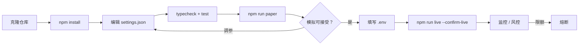
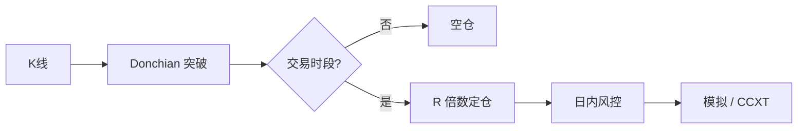

<p align="center">
  
</p>

# BloFin 日内交易机器人

<p align="center">
  <strong>日内交易定位 — 多保证金永续 + R 倍数出场</strong><br/>
  blofin · paper + live · risk-gated · MIT
</p>

<p align="center">
  
  
  
  
</p>

<p align="center">
  语言: [English](README.md) · **中文** · [Deutsch](README.de.md) · [Español](README.es.md)
</p>

> **搜索关键词:** blofin trading bot · blofin day trading · blofin perps · multi margin futures bot

---

## 项目工作流

克隆 → 配置 → 模拟 → 凭证 → 实盘。风控始终开启。



| | |
|--|--|
| `npm run paper` | 先跑模拟盘 — 无需 API Key |
| `npm run live` | 需要 `--confirm-live` 与 API 凭证 |

---

## 平台契合点

| | |
|--|--|
| 交易所 | blofin |
| 市场 | swap |
| 优势定位 | 日内交易定位 — 多保证金永续 + R 倍数出场 |
| 执行 | CCXT 实盘（优先 sandbox）+ 模拟盘 |

---

## 交易策略

BloFin 定位**日内多保证金永续**。本机器人仅在设定 UTC 时段内做**类 Donchian 突破**，按 **R 倍数**定仓（用固定权益风险对应止损距离），并限制**每日最大交易次数**，防止热行情变成报复性交易。

### 如何运作
- **时段过滤** — 仅在配置的 UTC 窗口交易。
- **Donchian 突破** — 带缓冲突破回看高低点。
- **R 定仓** — size ≈ (权益×风险%) / 止损距离。
- **出场** — 止盈/止损按 R 倍数。
- **日预算** — 超过 maxTradesPerDay 停止新开仓。
- **情景辅助** — 估算清算距离以检查杠杆。

### 优势出现的条件
**适合：** 时段开盘流动性好的 BTC 永续、清晰区间扩张。

### 何时失效
**失效：** 震荡反复打止损、杠杆过大破坏 R 计算、或把 maxTrades 调到失去意义。

### 关键参数（`settings.json`）
- `lookback`/`bufferPct`
- R 与风险%
- 每日交易上限与时段

### 策略特有风险提示
- 扣费后的日内永续是纪律游戏。
- 杠杆先保持低个位数。


---

## 策略流程图



---

## 架构

```
src/
  config/     Zod settings + env loader
  strategy/   venue-specific engine
  broker/     paper + CCXT live adapters
  risk/       daily loss / drawdown / caps
  app/        runtime loop
  session/
  sizing/
  signals/
```

---

## 快速开始

```bash
cd blofin-day-trading-bot
npm install
npm run typecheck
npm test
npm run paper
```

### 实盘

```bash
cp .env.example .env
# set BLOFIN_API_KEY + BLOFIN_API_SECRET
# optional BLOFIN_PASSWORD / PASSPHRASE
npm run live
```

---

## 配置

`settings.json` — strategy + risk + paper/live flags.  
`.env` — secrets only (see `.env.example`).

---

## 风险与安全

- Live refuses without `--confirm-live` and API credentials
- Prefer `live.sandbox: true` until proven
- Disable withdrawals on exchange API keys
- Daily loss / drawdown / notional caps + kill switch

---

## 免责声明

MIT 教育软件 — **不构成投资建议**。中心化交易所交易可能导致本金全部损失。

## 许可证

MIT — 见 [LICENSE](LICENSE)。
